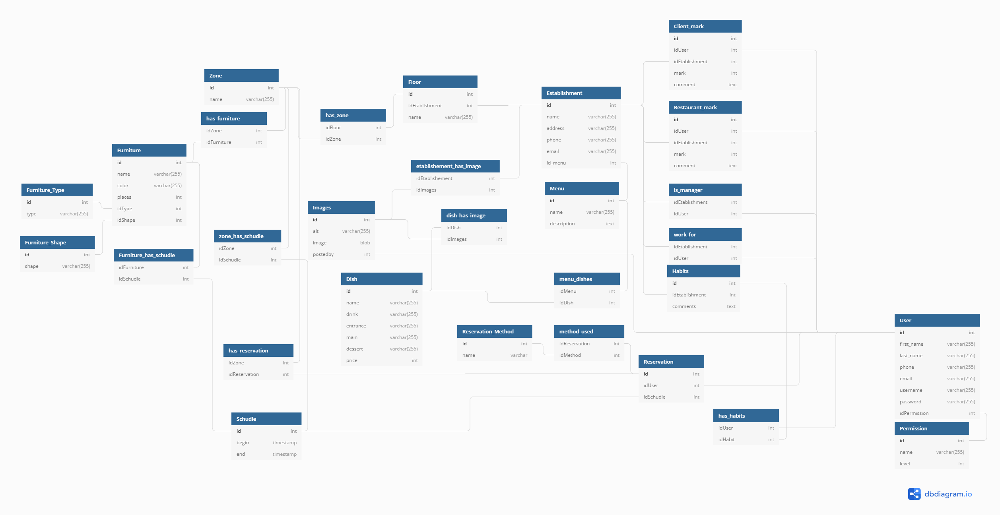

# JOURNAL DE BORD

## 06.04.20
- Création du Github
- Création du Trello 
- Appel avec m. Garcia pour mise en route du travail
- Création du document word pour la documentation

## 07.04.20
- Création du planning 
- Mise à jour du trello en fonction du planning
- UML : Je pense qu'il va manquer quelques tables, mais je n'arrive pas à savoir lesquelles. C'est pourquoi je vais commencer le projet avec les tables actuelles et j'ajouterais les tables au fur et a mesure.

- Mise en place et branchement du raspberry PI sur mon réseau local
- Mon rapsberry aura une adressen statique sur mon réseau privé afin de pouvoir tester l'âpplication depuis differents appareils

## 08.04.20
- Mise en place des liens entre les tables de la base de données. La base de données n'est pas encore complète. Il manque principalement la structure pour le stockage des position et forme pour l'UI style "drag & drop".
- Création de l'api
- /!\ L'API va me prendre plus de temps que ce que je pensais, je vais donc changer le Trello afin de créer des sous-tâches pour le dévellopement de l'API.

### API V1
Pour le moment mon API est encore très basique. Je n'ai que accès au employés et aux login. Afin de pouvoir accéder à la base de données, voici les logins :
- username : resa_tech_es
- password : WhutMerYmZeR6EHb

### Login avec l'API
Afin de stocker les mot de passe en hashé dans la base de données j'utilise un système de hashage.
1. l'utilisateur entre son mot de passe
2. Le mot de passe est ensuite hashé en sha256
3. la clé (u7csu5qH6Cp9xWkrIgtGvTsOosnKvH9RhQOXteJtNhknqrEHcjp8dCGYuv02SBoHGsBRoN0zGeGeToULmWUDTb2HAgnSGntNJHmg) est aussi hashée en sha256
4. On conquataine les deux chaines 
5. La chaîne finale est encore une fois hashée en sha256
6. Le programme copmpare la chaîne hashée avec la chaîne stockée dans la base

## 09.04.20
 - ~~Création de la section READ pour la table client dans l'API~~

### ~~API : READ Client~~
- ~~**GetAllCLients** : récupère tous les clients de la base de données~~
    1. ~~api/client/get/?all~~
- ~~**GetClientById** : récupère un client en fonction de son **id**~~
    1. ~~api/client/get/?id=[l'id que l'on cherche] (ex : get/?id=1)~~
- ~~**GetClientByLastname** : récupère tous les clients avec le nom de famille passé en paramètre~~
    1. ~~api/client/get/?lastname=[nom que l'on cherche] (ex : get/?lastname=Pala)~~
- ~~**GetClientByFirstname** : récupère tous les clients avec le prénom passé en paramètre~~
   1. ~~api/client/get/?firstname=[prénom que l'on cherche] (ex : get/?firstname=Ana)~~

Comme toute la structure de la base de données à changer, j'ai du changer l'API (en passant à la v2) et donc les fonctionnalités ci-dessus ne sont plus d'actualités.

## 14.04.20
- Mise à jour du Trello et réponses aux remarques de M. Garcia 
- Mise à jour du planning prévisionnel en incluant la mise en place de tests unitaires
- Modification de la base de données 
    - Ajout de la table "is_manager". Cette table permet à un gérant d'avoir plusieurs établissements
    - Ajout des tables de scores afin que les clients et les restaurateurs puissent ce mettre des notes anonymement
- Ajout de données dans la base de données afin de pouvoir faire les tests de l'API
- Les 'username' pour les employés sont générés automatiquement et sont unique à la base de données. Le login est composé d'uniquement 4 chiffres (je ne pense pas qu'un restaurant ai plus de 9999 employés...). Ce choix est fait pour permettre un login rapide en tapant uniquement les 4 chiffres du login et le mot de passe. A voir si je ne vais pas enlever le mot de passe lorsque l'on ce trouve sur le réseau du restaurant afin de pouvoir encore plus rapidement ce connecter lors du service.
- La table "is_manager" permet de stocker l'identifiant de l'employé qui est le manager. Ce manager peut avoir plusieurs restaurant et aussi être employé de ceux-ci ou d'autres (dont il n'est pas le manager).

### Comptes pour les test BDD

#### Employés
##### Administrateur
- username : 2008
- password : admin (b3ab939cbaa34ecf36b7e07bdcefce4d2c913517bd345daecab7f91c69fbe269)

##### Manager du Restaurant "Port Martignot"
- username : 3383
- password : manager (30963bb3ca13371a5b776434c2959c87b53113d7817a23a1f523c15863350ee7)

##### Employés du Restaurant
###### Olivier
- username : 5243
- password : e1 (3710f1a472febbc82026d64452ee8f1b38e801149b1c72310dc8e576b1d3b972)

###### Mathilde
- username : 9902
- password : e2 (4c4b520592f51d5456edd751d3f8d771a5c0895d65de5f8c9537804cffc32ad0)

#### Divers informations pour le restaurant
##### Floors (étages)
###### La térasse
- zone :
    1. Vue mer
    2. Vue village

- horaires : 
    1. Vue mer : 11:00 - 15:00
    2. Vue village : 11:00 - 15:00

###### La salle principale 
- zone :
    1. Piste de danse
    2. Coté bar
    3. Coté fenêtre

- horaires : 
    1. Piste de danse : 11:15 - 19:30
    2. Coté bar : 11:15 - 23:30
    3. Coté fenêtre : 11:15 - 23:30

## 15.04.20
- Discussion avec M. Garcia
    1. Ce focaliser sur la réservation interne 
    2. On est ouvert sur l'évolution de la visibilité exterieur 
    3. Fusionner les tables client et employé
    4. (Tâche future) Simuler de la charge 
- Modification de la base de données
    1. Ajout de la table images
    2. Ajout de la table de liasion entre menu et images + table de liaison entre etablissement et images
    3. Fusion de la table client et employé
- Après avoir mis à jour la base de données avec l'uml. Je dois refaire l'impo rtation dans mon serveur et mettre à jour les fichiers de l'API que j'avais déjà développer
- Je dois egallement réintroduire des données dans la base. Pour le moment je ne vais que créer des utilisateurs (les mêmes que cité ci-dessus), un restaurant, quelques zones, horaires et tables. Je m'occuperais de toute la partie réservation plus tard.

- Pour demain : mettre à jour la base de donnée du serveur

## 19.04.20
- La v2 de la base de données à été ajoutée au serveur
- Création des liens entre les tables

### Les niveaux de permissions
1. Administrateur
2. Manager
3. Serveur
4. Stagiaire (Je ne sais pas si ce niveau sera réellement utile, mais on ne sait jamais)
5. Client
6. Invité

### API V2
Afin de maintenir la base de données à jour avec l'api, j'ai décidé de reprendre l'api v1 et d'en faire une v2 afin de garantir le fonctionnement de la v1.

Voici le diagramme de la base de données dans la V2 de l'API :

#### Les changements par rapport à la v1
1. Il n'y a plus de dossier "user" et "employe", car les deux ont été funsionné (comme les tables) en user.
2. Dans le dossier user, on retrouve toujours le dossier get et set (qui ne sont pas terminés à ce stade) et un dossier employe. Ce dossier va me permettre de mieux gerer la partie uniquement employés. Je pense également mettre un dossier "clients" afin de mieux gerer les clients de la base de données.

#### La table "user"
La table user change donc. Il y a toujours le champ (permission qui risque de changer de table car un user peut etre manager d'un restaurant mais client d'un autre...)

/!\ Du coup je viens de me rendre compte que je dois changer ma base de données... Je ne vais pas créer un v3, je vais juste supprimer les tables non nécéssaires et ajoutés celles dont je vais avoir besoin. 

- Je supprime donc les tables "work_for" et "is_manager" ainsi que le champ "permission_id" de la table "user"
- je vais créer une table de liasion nommée "is_in_as" comme référence à : is in etablishement as ...". Cette table va prendre 3 champs
    1. L'id de l'user
    2. L'id du restaurant (etablissement)
    3. L'id de la permission
- L'id du restaurant reste NULL si c'est un administrateur qui as tous les droits sur tous les restaurants et sur l'application en entier 

#### Récuperer tous les employés qui sont dans la table "user"
Pour récuperer tous les user qui sont employés d'un ou de plusieurs restaurants, je dois passer par la table de laision "is_in_for".
Du coup j'ai créer une commande sql qui permet de retrouver tous les user en fonction de leur(s) permission(s).
- La commande : "SELECT `user`.`first_name`, `user`.`last_name`, `user`.`phone`, `user`.`email`, `user`.`username` FROM `user` WHERE `user`.`id` IN (SELECT `is_in_as`.`idUser` FROM `is_in_as` WHERE `is_in_as`.`idPermission` = [id de la permission que l'on cherche])"

Cette commande je vais la mettre dans le dossier "get" du dossier "user" et sara accessible comme ceci : Travail_diplome_ES_2020/RESA/api/v2/user/get/?as=[id de la permission que l'on cherche]

Je pense aussi faire la version ou on peut chercher en mettant le nom. par exemple : "manager" au lieu de "2", mais je ne sais pas si c'est vraiment utile en sachant que c'est l'application qui va faire les appels à l'API et non l'utilisateur

## 20.04.20
- Afin de garantir la sécurité de mes requètes, j'ai quand même mis en places quelques mesures de sécurités. Par exemple, dans la requête ci-dessus, avant de l'éxécuter, je vérifie bien que le paramètre envoyé est bien un entier afin de ne pas laisser entrer des requêtes externes.
- Avancement de l'API V2
- Avancement de la documentation en suivant les demandes faites par m. Garcia.
- Creation d'un répertoire de sauvegarde dans EDUGE + ajout du lien dans la documentation et le journal de bord

- Pour trouver tous les employés d'un restaurant, qu'il soit stagiaire, serveur ou manager, je vais créer une fonction qui regroupe tous les employés uniquemement en tapant l'id du restaurant.
  - La requete SQL : SELECT `user`.`first_name`, `user`.`last_name`, `user`.`phone`, `user`.`email`, `user`.`username` FROM `user` WHERE `user`.`id` IN (SELECT `is_in_as`.`idUser` FROM `is_in_as` WHERE `is_in_as`.`idEtablishement` = [id de l'établissement])

### /!\ Problème 1

#### Problématique
Je me retrouve face à un problème : la table "is_in_as" possède l'id du user, l'id de l'établissement et l'id de la permission.

Le but est que uniquement en mettant l'id de l'établissement, on puisse trouver les information de l'utilisateur avec ses permissions correspondantes pour l'établissement en question.

#### Solution possibles
1. J'ai d'abord regarder la solution de "UNION", mais ça ne correspond pas à ce que je cherche.
2. Faire un join et ensuite un select (pas sûr)

#### Solution
La solution à donc bien été de faire des inner join ( plus facile que ce que je pensais... !). La requête SQL ressemble donc à ceci : 

- SELECT u.first_name as user_firstname, u.last_name as user_lastname, p.name as permission_name, p.level as permission_level FROM is_in_as as iis INNER JOIN permission as p ON p.id = iis.idPermission INNER JOIN user as u ON u.id = iis.idUser WHERE iis.idEtablishement =  [id de l'établissement rechercher]

A présent, pour trouver tous les employés travaillant dans un restaurant, il suffit de rechercher l'id du restaurant désiré. 

ex : /RESA/api/v2/user/employes/?workingFor=1 (1 = Port Martignot)

### Etablissement
Il est possible qu'une de mes tables porte a confusion. La table "menu". En réalité cette table devrais s'appeller "carte", car la carte regroupe les différents menus que propose le restaurant.

Il faudrais aussi que j'ajoute une table pour des plats à l'unité mais ce n'est pas l'option clé de cette application.

- Ajout de la fonction pour pouvoir rechercher tous les restaurants ou juste un d'après son id.