# JOURNAL DE BORD

## 06.04.20
- Création du Github
- Création du Trello 
- Appel avec m. Garcia pour mise en route du travail
- Création du document word pour la documentation

---
## 07.04.20
- Création du planning 
- Mise à jour du trello en fonction du planning
- UML : Je pense qu'il va manquer quelques tables, mais je n'arrive pas à savoir lesquelles. C'est pourquoi je vais commencer le projet avec les tables actuelles et j'ajouterais les tables au fur et a mesure.


- Mise en place et branchement du raspberry PI sur mon réseau local
- Mon rapsberry aura une adressen statique sur mon réseau privé afin de pouvoir tester l'âpplication depuis differents appareils

--- 
## 08.04.20
- Mise en place des liens entre les tables de la base de données. La base de données n'est pas encore complète. Il manque principalement la structure pour le stockage des position et forme pour l'UI style "drag & drop".
- Création de l'api
- /!\ L'API va me prendre plus de temps que ce que je pensais, je vais donc changer le Trello afin de créer des sous-tâches pour le dévellopement de l'API.

### API V1
Pour le moment mon API est encore très basique. Je n'ai que accès au employés et aux login. Afin de pouvoir accéder à la base de données, voici les logins :
- username : resa_tech_es
- password : WhutMerYmZeR6EHb

### Login avec l'API (MAJ le 23.04.2020)
Afin de stocker les mot de passe en hashé dans la base de données j'utilise un système de hashage.
1. l'utilisateur entre son mot de passe
2. Le mot de passe est ensuite hashé en sha256
3. la clé (u7csu5qH6Cp9xWkrIgtGvTsOosnKvH9RhQOXteJtNhknqrEHcjp8dCGYuv02SBoHGsBRoN0zGeGeToULmWUDTb2HAgnSGntNJHmg) est aussi hashée en sha256
4. On conquataine les deux chaines 
5. La chaîne finale est encore une fois hashée en sha256
6. Le programme copmpare la chaîne hashée avec la chaîne stockée dans la base

---
## 09.04.20
 - ~~Création de la section READ pour la table client dans l'API~~

### ~~API : READ Client~~
- ~~**GetAllCLients** : récupère tous les clients de la base de données~~
    1. ~~api/client/get/?all~~
- ~~**GetClientById** : récupère un client en fonction de son **id**~~
    1. ~~api/client/get/?id=[l'id que l'on cherche] (ex : get/?id=1)~~
- ~~**GetClientByLastname** : récupère tous les clients avec le nom de famille passé en paramètre~~
    1. ~~api/client/get/?lastname=[nom que l'on cherche] (ex : get/?lastname=Pala)~~
- ~~**GetClientByFirstname** : récupère tous les clients avec le prénom passé en paramètre~~
   1. ~~api/client/get/?firstname=[prénom que l'on cherche] (ex : get/?firstname=Ana)~~

Comme toute la structure de la base de données à changer, j'ai du changer l'API (en passant à la v2) et donc les fonctionnalités ci-dessus ne sont plus d'actualités.

---
## 14.04.20
- Mise à jour du Trello et réponses aux remarques de M. Garcia 
- Mise à jour du planning prévisionnel en incluant la mise en place de tests unitaires
- Modification de la base de données 
    - Ajout de la table "is_manager". Cette table permet à un gérant d'avoir plusieurs établissements
    - Ajout des tables de scores afin que les clients et les restaurateurs puissent ce mettre des notes anonymement
- Ajout de données dans la base de données afin de pouvoir faire les tests de l'API
- Les 'username' pour les employés sont générés automatiquement et sont unique à la base de données. Le login est composé d'uniquement 4 chiffres (je ne pense pas qu'un restaurant ai plus de 9999 employés...). Ce choix est fait pour permettre un login rapide en tapant uniquement les 4 chiffres du login et le mot de passe. A voir si je ne vais pas enlever le mot de passe lorsque l'on ce trouve sur le réseau du restaurant afin de pouvoir encore plus rapidement ce connecter lors du service.
- La table "is_manager" permet de stocker l'identifiant de l'employé qui est le manager. Ce manager peut avoir plusieurs restaurant et aussi être employé de ceux-ci ou d'autres (dont il n'est pas le manager).

### Comptes pour les test BDD

#### Employés
##### Administrateur
- username : 2008
- password : admin (b3ab939cbaa34ecf36b7e07bdcefce4d2c913517bd345daecab7f91c69fbe269)

##### Manager du Restaurant "Port Martignot"
- username : 3383
- password : manager (30963bb3ca13371a5b776434c2959c87b53113d7817a23a1f523c15863350ee7)

##### Employés du Restaurant
###### Olivier
- username : 5243
- password : e1 (3710f1a472febbc82026d64452ee8f1b38e801149b1c72310dc8e576b1d3b972)

###### Mathilde
- username : 9902
- password : e2 (4c4b520592f51d5456edd751d3f8d771a5c0895d65de5f8c9537804cffc32ad0)

#### Divers informations pour le restaurant
##### Floors (étages)
###### La térasse
- zone :
    1. Vue mer
    2. Vue village

- horaires : 
    1. Vue mer : 11:00 - 15:00
    2. Vue village : 11:00 - 15:00

###### La salle principale 
- zone :
    1. Piste de danse
    2. Coté bar
    3. Coté fenêtre

- horaires : 
    1. Piste de danse : 11:15 - 19:30
    2. Coté bar : 11:15 - 23:30
    3. Coté fenêtre : 11:15 - 23:30

---
## 15.04.20
- Discussion avec M. Garcia
    1. Ce focaliser sur la réservation interne 
    2. On est ouvert sur l'évolution de la visibilité exterieur 
    3. Fusionner les tables client et employé
    4. (Tâche future) Simuler de la charge 
- Modification de la base de données
    1. Ajout de la table images
    2. Ajout de la table de liasion entre menu et images + table de liaison entre etablissement et images
    3. Fusion de la table client et employé
- Après avoir mis à jour la base de données avec l'uml. Je dois refaire l'impo rtation dans mon serveur et mettre à jour les fichiers de l'API que j'avais déjà développer
- Je dois egallement réintroduire des données dans la base. Pour le moment je ne vais que créer des utilisateurs (les mêmes que cité ci-dessus), un restaurant, quelques zones, horaires et tables. Je m'occuperais de toute la partie réservation plus tard.

- Pour demain : mettre à jour la base de donnée du serveur

---
## 19.04.20
- La v2 de la base de données à été ajoutée au serveur
- Création des liens entre les tables

### Les niveaux de permissions
1. Administrateur
2. Manager
3. Serveur
4. Stagiaire (Je ne sais pas si ce niveau sera réellement utile, mais on ne sait jamais)
5. Client
6. Invité

### API V2
Afin de maintenir la base de données à jour avec l'api, j'ai décidé de reprendre l'api v1 et d'en faire une v2 afin de garantir le fonctionnement de la v1.

Voici le diagramme de la base de données dans la V2 de l'API :


#### Les changements par rapport à la v1
1. Il n'y a plus de dossier "user" et "employe", car les deux ont été funsionné (comme les tables) en user.
2. Dans le dossier user, on retrouve toujours le dossier get et set (qui ne sont pas terminés à ce stade) et un dossier employe. Ce dossier va me permettre de mieux gerer la partie uniquement employés. Je pense également mettre un dossier "clients" afin de mieux gerer les clients de la base de données.

#### La table "user"
La table user change donc. Il y a toujours le champ (permission qui risque de changer de table car un user peut etre manager d'un restaurant mais client d'un autre...)

/!\ Du coup je viens de me rendre compte que je dois changer ma base de données... Je ne vais pas créer un v3, je vais juste supprimer les tables non nécéssaires et ajoutés celles dont je vais avoir besoin. 

- Je supprime donc les tables "work_for" et "is_manager" ainsi que le champ "permission_id" de la table "user"
- je vais créer une table de liasion nommée "is_in_as" comme référence à : is in etablishement as ...". Cette table va prendre 3 champs
    1. L'id de l'user
    2. L'id du restaurant (etablissement)
    3. L'id de la permission
- L'id du restaurant reste NULL si c'est un administrateur qui as tous les droits sur tous les restaurants et sur l'application en entier 

#### Récuperer tous les employés qui sont dans la table "user"
Pour récuperer tous les user qui sont employés d'un ou de plusieurs restaurants, je dois passer par la table de laision "is_in_for".
Du coup j'ai créer une commande sql qui permet de retrouver tous les user en fonction de leur(s) permission(s).
- La commande : ```SELECT `user`.`first_name`, `user`.`last_name`, `user`.`phone`, `user`.`email`, `user`.`username` FROM `user` WHERE `user`.`id` IN (SELECT `is_in_as`.`idUser` FROM `is_in_as` WHERE `is_in_as`.`idPermission` = [id de la permission que l'on cherche])```

Cette commande je vais la mettre dans le dossier "get" du dossier "user" et sara accessible comme ceci : Travail_diplome_ES_2020/RESA/api/v2/user/get/?as=[id de la permission que l'on cherche]

Je pense aussi faire la version ou on peut chercher en mettant le nom. par exemple : "manager" au lieu de "2", mais je ne sais pas si c'est vraiment utile en sachant que c'est l'application qui va faire les appels à l'API et non l'utilisateur

---
## 20.04.20
- Afin de garantir la sécurité de mes requètes, j'ai quand même mis en places quelques mesures de sécurités. Par exemple, dans la requête ci-dessus, avant de l'éxécuter, je vérifie bien que le paramètre envoyé est bien un entier afin de ne pas laisser entrer des requêtes externes.
- Avancement de l'API V2
- Avancement de la documentation en suivant les demandes faites par m. Garcia.
- Creation d'un répertoire de sauvegarde dans EDUGE + ajout du lien dans la documentation et le journal de bord

- Pour trouver tous les employés d'un restaurant, qu'il soit stagiaire, serveur ou manager, je vais créer une fonction qui regroupe tous les employés uniquemement en tapant l'id du restaurant.
  - La requete SQL : ```SELECT `user`.`first_name`, `user`.`last_name`, `user`.`phone`, `user`.`email`, `user`.`username` FROM `user` WHERE `user`.`id` IN (SELECT `is_in_as`.`idUser` FROM `is_in_as` WHERE `is_in_as`.`idEtablishement` = [id de l'établissement])```

### /!\ Problème 1

#### Problématique
Je me retrouve face à un problème : la table "is_in_as" possède l'id du user, l'id de l'établissement et l'id de la permission.

Le but est que uniquement en mettant l'id de l'établissement, on puisse trouver les information de l'utilisateur avec ses permissions correspondantes pour l'établissement en question.

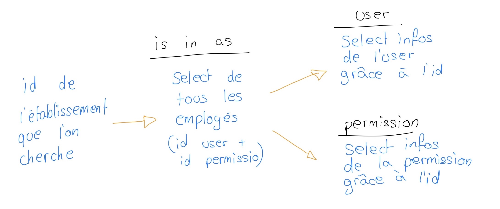

#### Solution possibles
1. J'ai d'abord regarder la solution de "UNION", mais ça ne correspond pas à ce que je cherche.
2. Faire un join et ensuite un select (pas sûr)

#### Solution
La solution à donc bien été de faire des inner join ( plus facile que ce que je pensais... !). La requête SQL ressemble donc à ceci : 

- ```SELECT u.first_name as user_firstname, u.last_name as user_lastname, p.name as permission_name, p.level as permission_level FROM is_in_as as iis INNER JOIN permission as p ON p.id = iis.idPermission INNER JOIN user as u ON u.id = iis.idUser WHERE iis.idEtablishement =  [id de l'établissement rechercher]```

A présent, pour trouver tous les employés travaillant dans un restaurant, il suffit de rechercher l'id du restaurant désiré. 

ex : /RESA/api/v2/user/employes/?workingFor=1 (1 = Port Martignot)

### Etablissement
Il est possible qu'une de mes tables porte a confusion. La table "menu". En réalité cette table devrais s'appeller "carte", car la carte regroupe les différents menus que propose le restaurant.

Il faudrais aussi que j'ajoute une table pour des plats à l'unité mais ce n'est pas l'option clé de cette application.

- Ajout de la fonction pour pouvoir rechercher tous les restaurants ou juste un d'après son id.

---
## 21.04.20
- Voici le schéma pour construire une zone dans un restaurant :
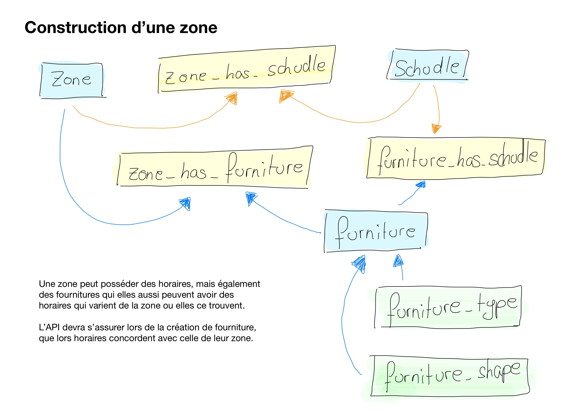

Afin de réaliser des tests, je vais utiliser les des zones (appartenant au restaurant port m.) et les horaires suivante :
1. Vue mer : 11:00 - 15:00
2. Vue village : 11:00 - 15:00
3. Piste de danse : 11:15 - 19:00
4. Côté bar : 17:00 - 23:00
5. Côté fenêtre : 11:15 - 23:30

"vue mer" et "vue village" ce trouvent sur "la terasse", alors que "piste de danse", "côté bar" et côté fenêtre" ce trouvent dans la salle principale.

1. Terasse
   1. Vue mer
   2. Vue village
2. Salle principale
   1. Piste de danse
   2. Côté bar
   3. Côté fenêtre

La table horaire contiens les données suivantes:
1. 11:00 - 15:00
2. 11:15 - 23:30
3. 11:15 - 19:00
4. 17:00 - 23:00

Afin de vérifier que les liasons soient correctes, je vais ajouter dans l'api une fonction qui permet de récupérer tous les étages avec toutes les informations les concernant d'un restaurant.

- Requête SQL pour récuperer tous les étages (floor) d'un restaurant : ```SELECT f.name FROM `floor` as f WHERE f.idEtablishment = 1```

- Requête SQL pour récupérer tous les étages avec leurs zones : ```SELECT f.id, f.name, z.name FROM `floor` as f JOIN `has_zone` as hz ON hz.idFloor = f.id JOIN `zone` as z ON z.id = hz.idZone WHERE f.idEtablishment = 1```

- Requête SQL pour récupérer toutes les infos sur les étages : ```SELECT f.id as floor_id, f.name as floor_name, z.name as zone_name, s.begin, s.end FROM `floor` as f JOIN `has_zone` as hz ON hz.idFloor = f.id JOIN `zone` as z ON z.id = hz.idZone JOIN `zone_has_schudle` as zhs ON zhs.idZone = z.id JOIN `schudle` as s ON s.id = zhs.idSchudle WHERE f.idEtablishment = 1```

Je dois maintenant faire le tri dans les données que je recois, car quand j'appelle la méthode, l'API me retorune pour le moment un tableau avec plusieurs fois le même étage (parcque cet étage a plusieurs zones). Hors, moi je veux 1 étages avec un tableau de ses zones.

Voici le résultat que j'obtiens avant le tri :


Afinde trier les données, j'ai créer une fonction qui va automatiquement créer un tableau d'étages qui contiendra le nom de l'étage et un tableau des zones :
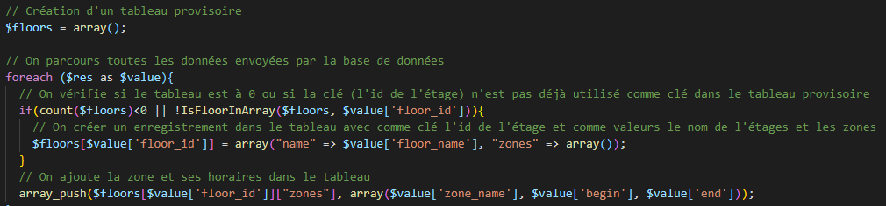

---

## 22.04.20

- J'ai ajouté 2 salles dans un nouvel établissement afin de tester le fait que la suppression d'un étage supprime bien les zones qui lui étaient associées
- Avant de faire le point ci-dessus, je vais d'abord faire en sorte de pouvoire créer un établissement, des étages et des zones
- Je viens de penser au fait que je devrais ajouter une table qui permet de gérer les exceptions, par exemple un jour une zone dois fermer plus tôt
- Création du "CREATE" pour les établissements
- Je souhaites récupérer toutes les permissions pour un utilisateurs. Pour ce faire je procède en 3 étapes :
    1. Je récupère les infos de l'utilisateurs
        -   ```SELECT `id`, `first_name`, `last_name`, `phone`, `email`, `username` FROM `user` WHERE `id` = [id de l'utilisateur]```
    2. Je récupère toutes les permissions qui sont accordées à l'utilisateur
        - ```SELECT IFNULL(e.name, "-") etablishment_name, IFNULL(p.name, "-") as permission_name FROM user as u LEFT JOIN is_in_as as iia ON iia.idUser = u.id LEFT JOIN establishment as e ON e.id = iia.idEtablishement LEFT JOIN permission as p ON p.id = iia.idPermission WHERE u.id = [id de l'utilisateur]```

### Récupérer le menus d'un restaurant
Afin de pouvoir récupérer tous les plats et compositions dans le menu d'un restaruant je dois procédé étape par étape. 
1. Récupérer le menu du restaurant : 
    - ```SELECT m.id, m.name, m.description FROM `menu` as m WHERE m.id IN (SELECT e.id_menu FROM `establishment`as e WHERE e.id = [id du restaurant])``` 
2. Récupérer tous les plats qui ce trouvent dans ce menu
    - ```SELECT d.name as dish_name, d.price as dish_price, dt.name as type_name FROM `menu` as m INNER JOIN `menu_has_dishes` as mhd ON mhd.idMenu = m.id INNER JOIN `dish` as d ON d.id = mhd.idDish INNER JOIN `dish_type` as dt ON dt.id = d.idType WHERE m.id IN (SELECT e.id_menu FROM `establishment`as e WHERE e.id = [id du restaurant])```
3. La prmière requête me donne un tableau avec les données de l'utilisateur et la deuxième me rend un tableau de tableau avec les permissions pour chaque établissement. J'ajoute donc un index nommé "permissions" dans le tableau de l'utilisateur ce qui donne ceci : 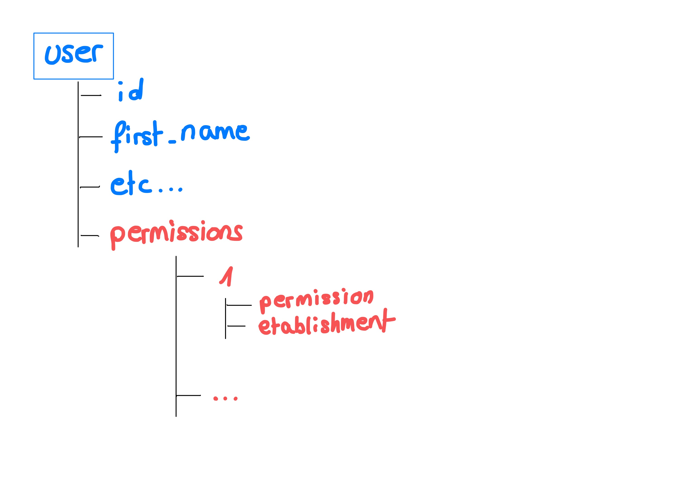


- Ajout de la table meal et de la table menu_has_meal
- La base de données gère comme ceci les menus des restaurants : 
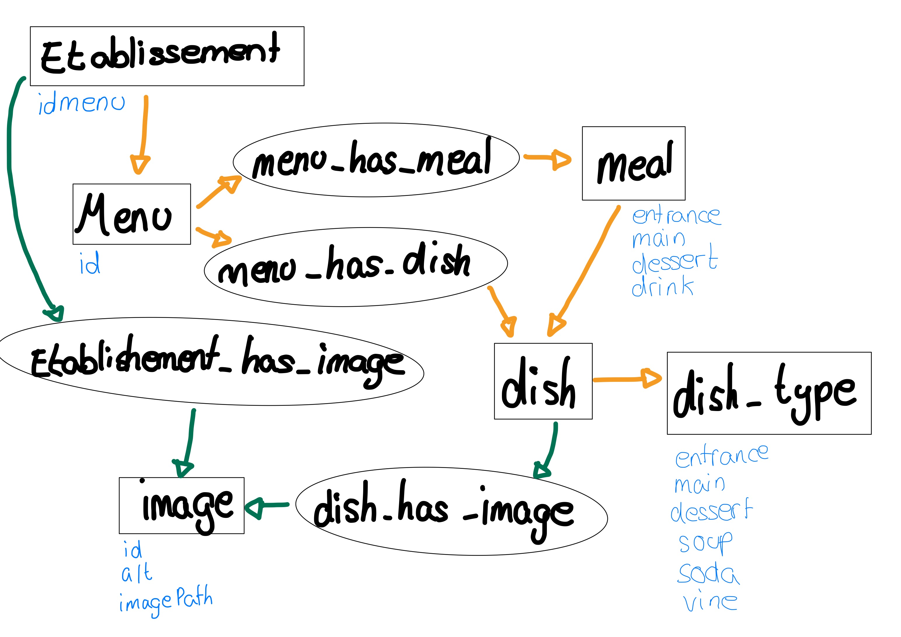
- J'ai ajouter des données dans la base afin de pouvoir faire des tests.
(Pour anouveau avoir le même résultat qu'avec les étages, je vais devoir reprendre la fonction [ci-dessus](./Documentation/Images/Fonction_recherche_etages.PNG) et l'ajuster pour les menus)

Pour récupérer les menus composés, il faut éxécuter une autre requête SQL
- ```SELECT ml.id as meal_id, ml.name as meal_name, entrance.name as entrance_name, main.name as main_name, dessert.name as dessert_name, IFNULL(drink.name, "-") as drink_name, ml.price as price FROM `menu_has_meal` as mhm INNER JOIN `meal` as ml ON ml.id = mhm.idMeal INNER JOIN `dish` as entrance ON ml.entrance = entrance.id INNER JOIN `dish` as main ON ml.main = main.id INNER JOIN `dish` as dessert ON ml.dessert = dessert.id LEFT JOIN `dish` as drink ON ml.drink = drink.id INNER JOIN `menu` as menu ON menu.id = mhm.idMenu WHERE mhm.idMenu IN (SELECT e.id_menu FROM establishment as e WHERE e.id = 2)```
- Résultat de la requête SQL :
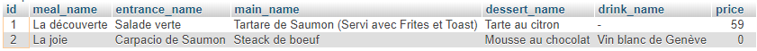

#### Unire les 2 résultats de recherche
Le but à présent est d'unire les 2 résultats. J'ai créer une fonction qui fait appel des deux fonctions ci-dessus et qui créer un tableau suivant :

- Menu
  - infos
    - id
    - name
    - description
  - dishes
    - Tableau des plats
  - Meals
    - Tableau des menus composés


### Appel avec M. Garcia
- Ajouter un état "non réservable" sur les fournitures
- Utiliser "distinct" ou "group by" pour la fonction de recherche de étages

### Test de "distinc" et de "group by"
#### Group by
- J'ai ajouté le paramètre suivant à ma requête SQL : ```GROUP BY f.id``` ou f.id = floor id. Mais SQL me donnais une erreur comme quoi je devais trier avec tous les champs.
- J'ai donc transformer le group by comme ceci : ```GROUP BY f.id, z.name, s.begin, s.end```. Le résultat était éxactement le même que sans rien...

#### Distinc
Le paramètre "distinc" permet de retourner uniquement des valeurs différentes. Le problème est que tous mes champs sont déjà différents, car chaque zone n'est attribuée que à un étage.

#### Conclusion
Les deux outils sont puissants et vont certainement êtres utiles dans un futur proche, mais pour cette fonction, ils ne sont malheureusement pas adaptés à ce que je veux faire.

---

#### Le développement de l'API va me prendre beaucoup plus de temps que prévu... je vais devoir faire des choix sur les fonctionnalités à ajouter... A suivre

---

---

## 23.04.20
### L'objectif du jour est de continuer un maximum l'API. Et de commencer 2 - 3 vues qui récupèrent les restaurants et leurs menus.
La complexité de mon travail de diplôme est la gestion de réservation en fonction des horaires des zones. Pour le moment je ne me suis pas encore penché sur le problème, car l'API de base, me prend du temps. Je vais revoir mon planning.

- Geré le Login d'un utilisateur
  - J'utilise la même méthode que dans la V1 de l'API


- Création d'un cheat sheet pour l'API afin de rendre son utilisation plus facile par un externe
  - Le but de ce cheat sheet est de faciliter l'utilisation de l'API aux personnes qui aurons besoin de l'utiliser afin de continuer l'application ou pour une autre utilisation.
  - Ca me permet également de retrouver ou et comment récupérer un certain type de données que je cherche.

- Au début je pensais commencer des vues, mais le cheat sheet me prend pas mal de temps, je commencerais donc les premières vues demain.
### APPEL M. Garcia
- Regarder pour convention / norme requête SQL

#### Bonnes pratiques SQL
Afin d'unifier mon code avec les bonnes pratiques, je me suis référé au [site](https://wiki.easyvista.com/xwiki/bin/view/Documentation/SQL+rules?language=fr) que m. Garcia m'as fait parvenir.

---
## 24.04.20

### CES DIAGRAMMES d'ACTIVITES NE SONT PLUS A JOUR ! VOIR PLUS BAS ...
- Création du  diagramme d'activité pour la création d'un compte client dans l'application :
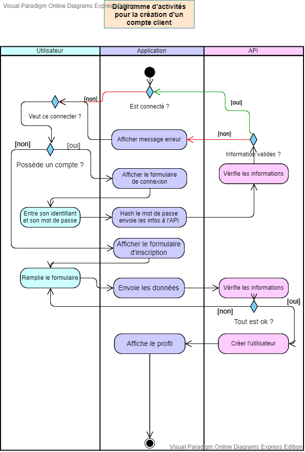

- Création du  diagramme d'activité pour faire une réservation dans un restaurant :
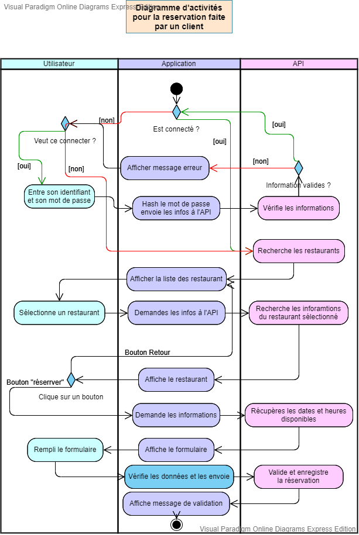

- Objectif actuellement :
  - Faire les vues et le script qui tourne derrière afin de déjà faire fonctionner les diagrammes ci-dessus
  - Mettre à jour la documentation avec les demandes de m. Garcia : **OK** 
  - Mettre en place le système des images afin d'avoir de belles vues : **OK [terminé le 24.04 à 23:53]**

- Afin de pouvoir mettre les images dans la base de données avec un uniqID, je dois créer une page provisoire pour uploader les photos sur le serveur
  - Je vais donc créer une page php avec une form simple qui me permet de selectionner un des plats de la base et la photo à mettre en ligne
  - La page est accessible via : ```/api/v2/images/upload/debug/```
  - J'ai vite du ajouter une fonction dans l'API, une fonction qui me permet de récupérer tous les plats de la base
  - J'ai donc créer un formulaire qui permet de sélectionner le restaurant ou le repas auquel on souhaites ajouter une photo. 
  - Il faut maintenant que je fasse la partie de l'API qui permet d'ajouter le lien entre la photo et le plat ou l'etablissement
  - J'ai créer la partie de l'api qui me permet de mettre en ligne un photo avec un uniqid. (Ca m'as pris un temps fou)
  - L'upload est totalement temriné ! ```/api/v2/images/upload/```
    - Pour utiliser ce fichier, il faut l'include dans celui qui va envoyer l'image (Plus d'explication dans le Cheat sheet de l'API v2)
  - Il est possible de récupérer les informations d'une image d'après son id et le paramètre "data". ```/api/v2/images/get/?path&id=[id de l'image]```
  - Il est possible d'être directement rediriger sur la photo en indiquant uniquement son id : ```/api/v2/images/get/?id=[id de l'image]```
  - Il est possible de récupérer toutes les images d'un établissement !
  - Je suis en train d'ajouter la requête pour récupérer toutes les photos d'un plat mais je me dis que je devrais aussi faire en sorte que l'on puisse récupérer toutes les images d'un menu entier d'un restaurant. A retenir

### Evalutation intermédiaire (appel avec m. Garcia)
#### Documentation 
- Ajouter le numéro de version sur la page de garde : **OK**
- Titre de la table des matières : **OK**
- Mettre des numéros devant les titres : **OK**
- Ajouter le mot "page" devant le numéro de page + "/" et le numéro de pages totaux du document : **OK**
- Créer un diagramme d'activités (par qui ça passe) -> J'en ai fait 2, ce sont les deux avec lesquels je vais commencer les vues

#### Github
- Penser à supprimer les mot de passes

#### Google Drive
- (Ajout la syncronisation avec google Drive)
- Faire des backups QUOTIDIEN et non tous les 2 jours
- Règle de nommage : ```année_mois_jour(_heure_minute_secondes)_[nom fichier].extension```

#### Serveur 
- J'aurais du utiliser WSL au lieu de laragon

#### Login
- Au lieu d'utiliser des cartes RFID 

#### Images
- Utiliser la fonction unique ID de PHP pour renommer les images mises en ligne
- https://www.php.net/manual/fr/function.uniqid.php

#### Poster
- Expert ont de la peine a ce retrouver -> faire un diagramme physique

---
## 26.04.20
- Suite de la documentation, commencement de la partie de la gestion des images.
- J'ai commencer la structure de l'API dans la documentation, mais je ne vais pas la terminer car celle.ci risque de changer.

### Page Login
- Création de la page de login à partir du template
  - Nettoyage de la page et des composants non-nécéssaires

### Idées pour plus tard afin de encore plus me faciliter la vie
- Ajout d'un nouveau fichier dans le dossier ```images``` de l'API. Ce fichier va permettre de directement envoyer le résultat d'un ```forms``` directement à ce fichier afin qu'il puisse ajouter la photo dans la base de données.

--- 
## 27.04.20

### Appel avec m. Garcia
- Voir si Laraval et iyy peut être plus efficace

- J'ai effectuer des recherches pour voir si Laravel ou iyy allaient pouvoir me faciliter la tâche pour mon travail. Malheureusement rien ne correspond à ce dont j'ai réellement besoin, car mes requêtes sont tellement spécifiques que un générateur de code ne me sert à rien.

---
## 28.04.20

- Création du [fichier](./Documentation/Gestion_taches_API.xlsx) 
 des tâches à faire pour l'API 
- Je vais reprendre mes diagrammes d'activités
  - Il faut que je comprenne d'abord, comment réaliser correctement un diagramme d'activité.
  - Je vais utiliser le lien ci-dessus comme model pour les normes que j'utilise.
- J'ai un peu continuer la documentation

- Création du diagramme d'activité pour la connexion et création de compte : 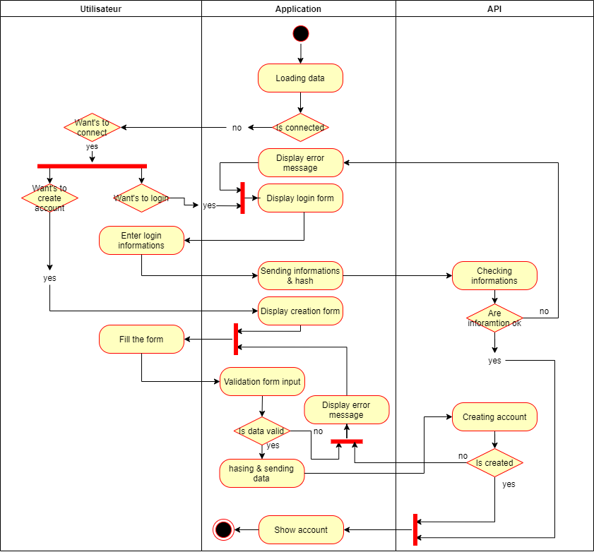 

Après avoir pris 2 jours de recul sur mon projet, j'ai pu me rendre compte de ce que j'avais réellement à faire. Je vais donc faire un nouveau tableau des tâches à faire (dans l'ordre) et des priorités. Comme c'est un projet qui demande beaucoup de temps et de tables, je dois faire la part des choses.

- Croquis des choses à faire dans un premier temps : 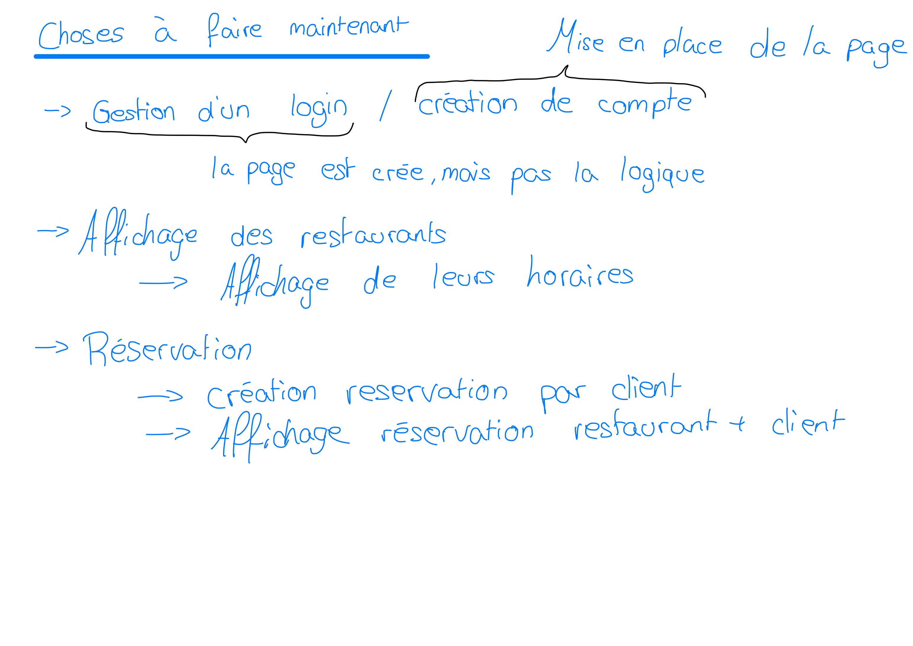 

- Mise au propre des choses à faire : 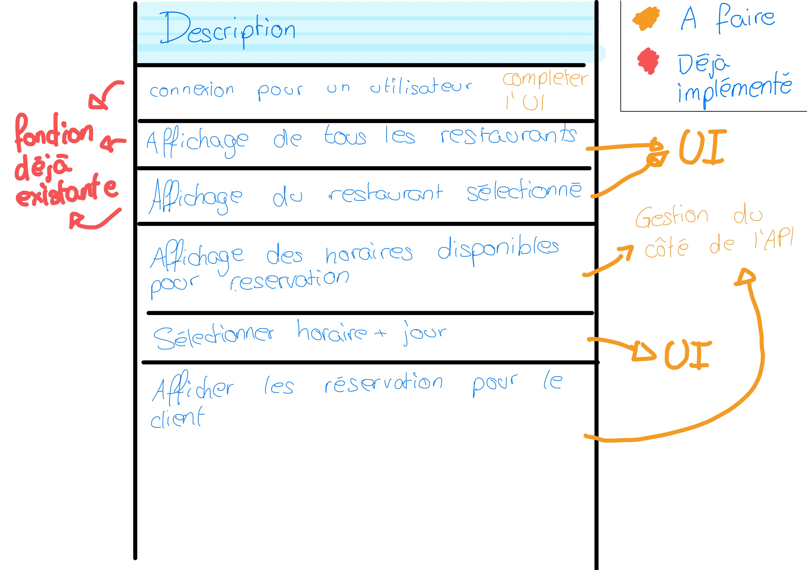 

M. Garcia valide ma nouvelle approche.

### Appel avec m. Garcia 
- Utilisation de DrawIO 
  - Permet de sauver directement dans le Google Drive
  - Produit directement les UML
- Trouver des normes pour lés diagrammes d'activités : https://sourcemaking.com/uml/modeling-business-systems/external-view/activity-diagrams
- Inconsistances dans les diagrammes
  - S'inspirer des normes
  - Revoir mes diagrammes

---
## 29.04.20
- Je suis en train de faire le login d'un utilisateur, je me suis rendu compte que je devais faire la différencation de si il s'agissait d'un login client ou d'un login utilisateur local.
  - Il faut que j'ajoute à l'API une fonctionnalité qui gère la différence
    - Je vais donc créer cette fonctionnalité
    - Afin de pouvoir ajouter cette fonctionnalité, j'ai un petit souci... Un utilisteur admin peut ce connecter dans tous les restaurants, il faut donc que ma requête gère si il s'agit de d'un admin
    - ### Il ne faut pas que j'oublie de mettre à jour le cheat sheet !
  - Il faut que j'ajoute une fonction de login avec l'email 
  - (je ne sais pas si je dois aussi hasher le username et l'email ou non ... Pour le moment je ne vais pas le faire car les emails sont public...)
- Ajout du fond d'écran de tous les profils utilisateurs
  - Accessible à partir de l'API
- Il faut que je fasse un table de liaison entre les utilisateurs et une photo de profil
  - La table de liaison est terminée
  - Ajout d'une image test grace au debug
- Il faut mettre à jour l'API pour récupérer l'image l'utilisateur
  - C'est fait ! Pour accéder à la photo, il faut récupérer le chemin de l'image sur ce lien : ```http://localhost/Travail_diplome_ES_2020/RESA/api/v2/images/get/?user&id=[id de l'utilisateur]```

Malheureusement aujourd'hui je n'ai pas fait tout ce que je voulais... Je n'ai fait que le login avec l'affichage de l'utilisateur connecté. Demain j'affiche tous les réstaurants !

### Requête de login employé
Vérifie uniquement si l'utilisateur travail bien pour l'établissement : ```SELECT u.id as idUser, u.first_name as firstnameUser, u.last_name as lastnameUser, u.phone as phoneUser, u.email as emailUser, p.name as namePermission, p.level as levelPermission, IFNULL(e.id, "-") as idEtablishment, IFNULL(e.name, "-") as nameEtablishment FROM `is_in_as` as iia INNER JOIN `permission` as p ON p.id = iia.idPermission LEFT JOIN `establishment` as e ON e.id = iia.idEtablishement INNER JOIN `user` as u ON u.id = iia.idUser WHERE iia.idUser IN (SELECT `id` FROM `user` WHERE `username` = '[numéro d'identification]' AND `password` = '[mot de passe hashé]') AND iia.idEtablishement = [id de l'établissement]```

Retourne le nom de l'utilisateur si l'identifiant d'utilisateur et le mot de passe éxistent bien dans l'établissement ou est membre de l'administration :
```SELECT u.id as idUser, u.first_name as firstnameUser, u.last_name as lastnameUser, u.phone as phoneUser, u.email as emailUser, p.name as namePermission, p.level as levelPermission, IFNULL(e.id, "-") as idEtablishment, IFNULL(e.name, "-") as nameEtablishment FROM `is_in_as` as iia INNER JOIN `permission` as p ON p.id = iia.idPermission LEFT JOIN `establishment` as e ON e.id = iia.idEtablishement INNER JOIN `user` as u ON u.id = iia.idUser WHERE iia.idUser IN (SELECT `id` FROM `user` WHERE `username` = '[numéro d'identification]' AND `password` = '[mot de passe hashé]') AND (iia.idEtablishement = [id de l'établissement] OR iia.idPermission = 1)```

La requête ci-dessus ne me sert pas dans l'imédiat, mais au moins elle est prête !

### Création de la page de profil
- Reprise du template pour créer la page de profil de l'utilisateur 
- Il faut maintenant que je récupère les données de la session afin de vérifier que l'utilisateur soit bien connécté et qu'il puisse bien avoir ces informations

### Appel avec m. Garcia
- Chercher un outil qui intègre des données dans la base 
  - Il va contacter un ancien élève qui avait utilisé ça. En attendant de ses nouvelles, je vais continuer mon programme.

- Liens potentiels pour le remplissage automatique de données :
  - http://www.generatedata.com/?lang=fr#t1
  - https://github.com/benkeen/generatedata

---
## 30.04.20
- Finitions de la page des établissements
- Ajout d'établissements dans la base afin de tester la mise en page
  - J'ai fait exprès de ne pas mettre de photo pour un réstaurant afin que celui-ci affiche l'image par défaut
- Je vais faire la page qui affiche le réstaurant afin de pouvoir commencer à faire la logique des réstaurants
- J'ai créer dans la page de l'utilisateur un panel qui contient 3 tabs
  - Le premier permettra de voir les dernieres ou futures réservations
  - Le deuxieme permettre de changer la photo de profil (C'est peut-être la que je vais utiliser le Dropzone.js [REF : ci-dessous])
  - Le dernier permet de créer facilement un établissement
    - J'ai du mettre en place le formulaire avec les tests pour vérifier que les champs étaient bien valides
    - J'ai du ajouter une partie à l'API 

### Création d'un nouvel établissement 
Voici comment je créer la query que j'envoie ensuite pour la création d'un nouvel établissement
```
$queryData = array(
    'name' => $data['name'],
    'address' => $data['adress'],
    'phone' => $data['phone'],
    'email' => $data['email'],
    'creatorID' => $creatorID
);

$link1 = $path."etablishment/create/?".http_build_query($queryData);

file_get_contents($link1);
```

- J'ai du faire beaucoup de changements du côté de l'API dans les images
  - ```SaveImageDish``` ainsi que ````SaveImageUser``` ne fonctionnent plus actuellement, mais ce ne sont pas des priorités pour le moment

La deuxième étape, est de faire un upload des images sur le serveur... un peu plus compliqué.
- ~~Je viens de voir un problème que j'avais dans ma logique d'enregistrer mes images... malheureusement je les enregistrait dans mon API, hors je dois les enregistrer sur le site web et uniquement envoyer le lien à l'API~~

### MAJ API
- Ajout de la fonctionnalité "is in as" qui permet de directement mettre le créateur de l'établissement en temps que manager 
- Cette fonction peut être utilisée pour tout type d'ajout (pas seulement manager)
- Afin que je puisse directement assigné le créateur en temps que manager, je dois récupérer le dernier ID introduis dans la base de données.
- Il faut que je finisse la méthode ```is in as``` car je l'ai oubliée ...
  - C'est fait ! J'ai perdu énormément de temps car j'avais inversé 2 champs (tristesse)
- Il faut que j'ajoute aussi un fonction qui me permet de récupérer tous les restaurants d'un manager
  - D'abord je récupère tous les établissements ou travaille le manager (à garder, elle pourra me servir plus tard)
    - SQL : ```SELECT e.id, e.name FROM `is_in_as` as iia INNER JOIN `establishment` as e ON e.id = iia.idEtablishement WHERE iia.idUser = [id du manager]```
  - J'ajoute juste le ```AND``` à la fin avec l'id des manager (2)
    - SQL : ```SELECT e.id, e.name FROM `is_in_as` as iia INNER JOIN `establishment` as e ON e.id = iia.idEtablishement WHERE iia.idUser = [id du manager] AND iia.idPermission = 2```

~~### Dropzone.js~~
- ~~Afin de pouvoir autoriser le ```drag & drop``` de photos dans mes formulaires, j'ai utilisé un librairie standalone. Cette librairie s'appelle [dropzone.js]("https://www.dropzonejs.com/")~~
- Malheureusement ça ne fonctionnais pas comme je le pensais et ça n'est pas compatible avec mon utilisation... Je ne vais pas m'attarder plus sur ça aujourd'hui.
Si jamais j'ai à nouveau besoin, voici les 2 includes :
  - ```<link rel="stylesheet" href="https://cdnjs.cloudflare.com/ajax/libs/dropzone/5.5.1/dropzone.css" />```
  - ```<script src="https://cdnjs.cloudflare.com/ajax/libs/dropzone/5.5.1/dropzone.js"></script>```

### Appel avec m. Garcia
- Les utilisateur doivent êtres archivés
  - Afin de garder l'historique
- Trouver un outil qui fait toute l'arboration de l'API
  - La commande ```tree``` dans le cmd

### Programme pour demain (avant que j'oublie)
- Afficher la liste de tous les établissements appartenant à un utilisateur
- Afficher la liste de tous les établissements ou travaille l'utilisateur 
- Mettre à jour le Cheat Sheet pour l'API 
- Mettre à jour les commentaires de l'API
- Continuer A FOND la documentation

---
## 03.05.20

Finalement ce n'était pas le lendemain mais dimanche...
- Afin de pouvoir afficher tous les établissement dont un utilisateur est le manager, il faut d'abord que j'ajoute des fonctionnalités à l'API :
  1. Récupérer tous les etablissements dont il est le manager 
    - Afin de pouvoir faire ça, je dois faire une requête qui récupère tous les établissement ou l'utilisateur est mambre du staff et qu'il à l'id du manager
    - SQL : ```SELECT e.id, e.name FROM `is_in_as` as iia INNER JOIN `establishment` as e ON e.id = iia.idEtablishement WHERE iia.idUser = [id de l'utilisateur] AND iia.idPermission = [id de la permission]```
    - OK, je récupère tous les établissements dont l'utilisateur est le manager
  2. Créer la page d'administration de l'établissement
    - Il faut que je créer a partir des composants du template une page qui affiche tous les menus importants pour la gestion du restaurant

Voici les objectifs de la semaine du 04.05 au 08.05 
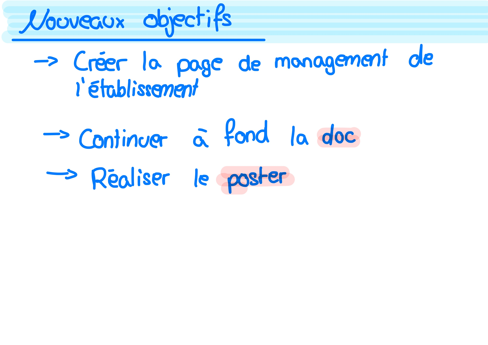 

En détails les objectifs de la documentation, elle dois être prête pour l'évaluation intermédiaire pour vendredi
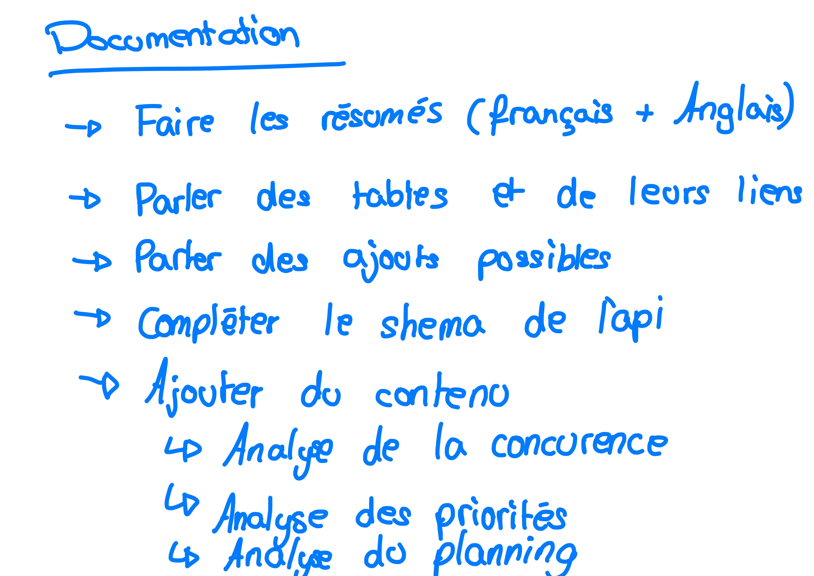 

Les objectifs pour le poster
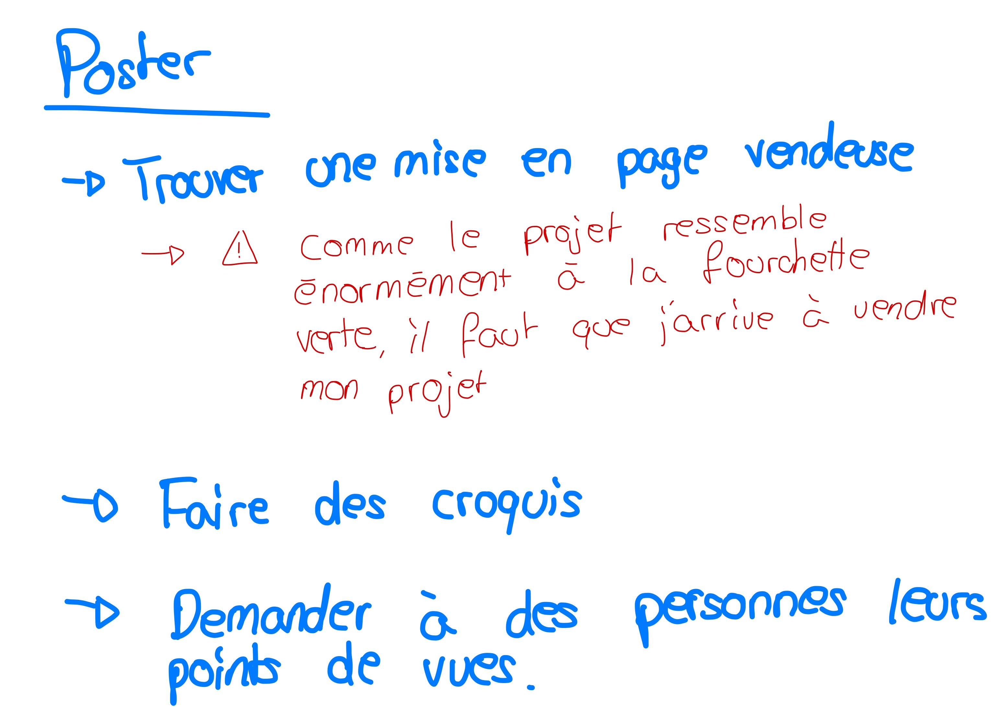 

---
## 04.05.20
- J'ai continuer la page de gestion de l'établissement 
  - J'ai un problème avec les liens dans la navbar
  - Quand je met un lien générer en php, ça change le CSS du lien
  - Je laisse ça de côté
- Affichage des boutons pour ajouter des zones à un étage
  - Création du formulaire
  - il faut que je fasse la partie de l'APi maintenant
    - SQL (assez basique): ```INSERT INTO `zone`(`name`) VALUES ('[nom de la zone]')``` 
    - Il faut maintenant faire la logique dans l'API
      - Il faut faire le lien entre l'étage et la zone que je veut lier 
      - Je créer donc une fonction qui va ajouter la nouvelle zone à l'étage
    - Il est possible de créer une zone pour un étage !
    - Il faut maintenant faire le formulaire de création de l'étage
      - Comme pour la zone, je vais faire un bouton qui permet de faire apparaitre le formulaire de la création de l'étage

- Il est possible de créer des étage et de créer des zones qui vont dans ces étages. Maintenant il faut que je créer les formulaires qui permettent de mettre à jour ces zones en y insérant des horaires et des fournitures
- Pour les horaires et les fournitures je vais devoir créer les vues et les API 

- Il faut que je récupère tous les horaires pour une zone
  - SQL : ```SELECT s.id as schedule_id, s.begin as begin, s.end as end FROM `zone_has_schudle` as zhs INNER JOIN `schudle` as s ON s.id = zhs.idSchudle WHERE zhs.idZone = [id de la zone]```
  - Il est possible d'afficher les horaires d'une zone en cliquant sur le bouton "horaires"
- Il faut ajouter une table qui affiche les fournitures de la zone, je vais donc utiliser l'application que m. Garcia m'avais envoyé pour générer des fournitures
  - J'ai générer 100 meubles 
    - Ils ont tous un nom aléatoire (d'un être humain haha)
    - ils sont tous bleus
    - Ils ont tous une forme et un type différent

- Pour récuipérer tous les fournitures d'une zone :
  - SQL : ```SELECT f.id as furniture_id, f.name as furniture_name, f.color as furniture_color, f.places as furniture_places, ft.id as type_id, ft.type as type_name, fs.shape as shape_name FROM `has_furniture` as hf INNER JOIN `furniture` as f ON f.id = hf.idFurniture INNER JOIN `furniture_type` as ft ON ft.id = f.idType INNER JOIN `furniture_shape` as fs ON fs.id = f.idShape WHERE hf.idZone = [id de la zone]```

- Compter le nombre de places totales dans une zone :
  - SQL : ```SELECT SUM(f.places) as places_totales FROM `has_furniture` as hf INNER JOIN `furniture` as f ON f.id = hf.idFurniture WHERE hf.idZone = [id de la zone]```

 

### Appel avec m. Garcia
- Il faut absolument continuer la documentation pour jeudi 17h

---
## 05.05.20
- Téléchargement de Photoshop pour le poster
  - Création des maquettes du poster 
  - Esquisse 1 :  
  - Esquisse 2 :  
- Avancement de la documentation
  - Ajout de pleins de chapitres et de sections

### Appel avec m. Garcia
- Ajouter un point d'ancrage X et Y pour les zones et fournitures
  - limiter la taille du restaurant
  - taille maximale par zone
- Révision de la documentation demain matin
  - Ajouter un paragraphe pour expliquer la zone

---
## 06.05.20
- Finalisation du poster avec les commentaires de m. Garcia
- Créations de divers schémas de fonctionnement afin de mieux comprendre l'application.
### Création poster 
 

### Appel avec m. Garcia
- Mettre le texte en justifier
- Chose essentiel qui manque :
  - Ajouter des shémas de fonctionnement
    - Ou est l'application ?
    - Qu'est-ce qu'elle fait ?
  - Logiciel utilisés

- Comment détecter que c'est image qui est envoyée
- Pouvoir envoyer un rollback pour comfirmer que tout à bien été fait

---
## 07.05.20
- Finalisation de la documentation pour l'évaluation intermédiaire

### Appel avec m. Garcia
- Faire aussi une analyse sur le lien que m. Garcia
- Ajouter des legendes aux codes 
- Documentation à la programmation manquante
  - Parler de ce que je recois en JSON
  - Zoomer sur le fond du code 
- Pour le MCD , entouré les parties user, reservations, etc.

---
## 08.05.20

### Appel avec m. Garcia
- Créer des renvoi pour le schéma du login
- Mettre un schéma pour le json 

- Renvoie vers les paragraphes pour les utilisateurs
- Ajouter le hashage dans la documentation

- Parler des versions de l'API (faire évoluer)
- Ce renseigner sur l'uniqid (13 digits)
- Archiver les utilisateurs et les établissements au lieu de les supprimer

#### Application 
- Ajouter les dates sur le widget des reservations
- Ajouter un calendrier des réservations

---
## 12.05.20
Objectifs de la semaine:
- Ajouter des horaires dans les zones
- Créer des fournitures
- Ajouter des horaires au fournitures
- Récupérer les réservations pour le restaurant
- Récupérer les réservations pour le client
- Créer une réservation dans un établissement
  - Il faut prendre en compte les horaires des zones et de l'établissement
  - Il faut prendre en compte les crénaux qui ne sont pas encore réservés afin de proposer une réservation au client
- Créer d'autres schéma de fonctionnement
- Créer d'autres diagrammes d'activités
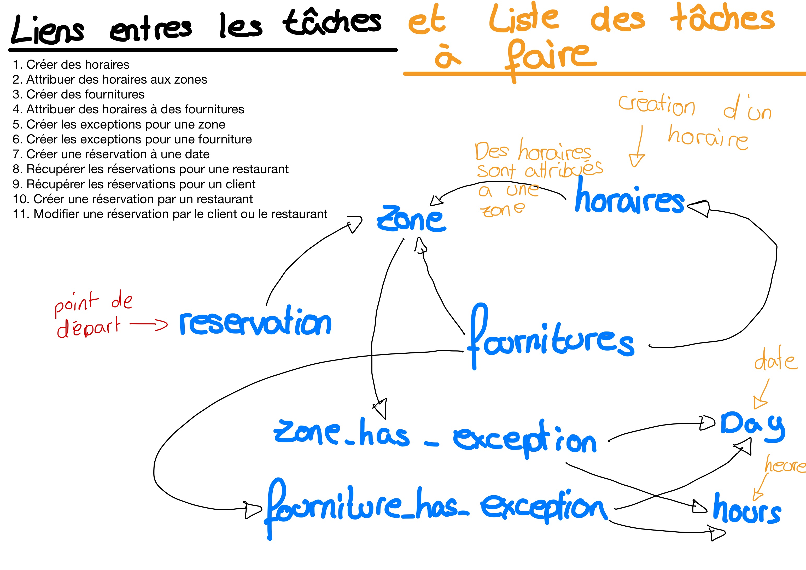 

Il faut d'abord que je définisse ce qu'est réellement une réservation :
 

### Les horaires
Comme on peut le voir sur la liste de tâches, la première chose à faire est de créer une page d'administration ou l'on peut créer des horaires ou récupérer ces proposés par les autres établissements. 
- Une fois un horaire créer, il est impossible pour un utilisateur standard de le supprimer, car l'horaire peut être utilisé par un autre restaurant
Création d'un horaire :
- SQL : ```INSERT INTO `schudle`(`begin`, `end`) VALUES ('[heure de début]', '[heure de fin]')```

### Page admin
Création de la page d'administration générale :
- Enfaite, je vais mettre des widgets sur la page de l'établissement du manager, ça serais mieus pour l'UI

### Zones et fournitures
- Il faut que je récupère toutes les places dans une zone
- SQL ```SELECT IFNULL(SUM(f.places), 0) as "places_total" FROM `has_furniture` as hf INNER JOIN furniture as f ON f.id = hf.idFurniture WHERE hf.idZone = [id de la zone]```
- La page d'administration affiche le nombre de places totales dans une zone

- Il faut ajouter une page de gestion des fournitures pour les zones, c'est à fire une page ou l'on peut voir, modifier ou supprimer les fournitures de la zone. On doit également pouvoir changer les horaires de ceux-ci
  - Je vais ajouter sur la page d'administration un bouton pour chaque zone qui affiche les fournitures de cette dernière
  - Le bouton ce créer et j'arrive a ouvrir un modal
  - Il faut maintenant que je récupère les fournitures de la zone
    - SQL : ```SELECT f.id as fid, f.name as fname, f.color as fcolor, f.places as fplaces, fs.id as fsid, fs.shape as fsname, ft.id as ftid, ft.type as ftname FROM `has_furniture` as hf LEFT JOIN `furniture` as f ON f.id = hf.idFurniture LEFT JOIN `furniture_type` as ft ON ft.id = f.idType LEFT JOIN `furniture_shape` as fs ON fs.id = f.idShape WHERE hf.idZone = [id de la zone]```
    - J'arrive à afficher toutes les fournitures dez zones dans un modal
- Il faut aussi ajouter la possibilité de modifier ou de créer une excpetion sur une zone (plus tard)

### Appel avec m. Garcia
- Discussion de retour de Nadège sur la documentation
  - Plus faire la différence entre le client et le restaurateur

---
## 13.05.20
Il faut créer un petit formulaire pour créer un nouveau meuble
- Je me suis dis qu'il devait être possible de créer un meuble, mais que celle-ci soit ensuite déplacée dans le restaurant. 
  - C'est à dire, ajouter un champ dans la table des fournitures afin d'ajouter l'id de l'établissement
  - Donc, je vais commencer par créer un widget, afin de voir toutes les fournitures du restaurant
  - Depuis ce widget, il sera possible de voir dans quelle zone ce trouve la fourntiure et il sera aussi possible de modifier cette zone ainsi que directement le meuble
  - Il faut ajouter à l'API le fait de récupérer toutes les fournitures d'un établissement
    - ~~SQL : ```SELECT zone.id as zoneid, zone.name as zonename, f.id as fid, f.name as fname, f.color as fcolor, f.places as fplaces, ft.id as ftid, ft.type as ftname, fs.id as fsid, fs.shape as fsshape FROM `floor` as floor LEFT JOIN `has_zone` as hz ON hz.idFloor = floor.id LEFT JOIN `zone` as zone ON zone.id = hz.idZone LEFT JOIN has_furniture as hf ON hf.idZone = zone.id LEFT JOIN furniture as f ON f.id = hf.idFurniture LEFT JOIN furniture_type as ft on ft.id = f.idType LEFT JOIN furniture_shape as fs ON fs.id = f.idShape WHERE floor.idEtablishment = [id de l'établissement recherché] ORDER BY zone.id```~~
    - Je me suis rendu compte que ça ne retournais pas exactement ce que je voulais... en effet j'ai besoin de récupérer TOUTES les fournitures d'un restaurant et pas seulement celles qui sont dans des zones.
    - Nouveau SQL : ```SELECT f.id as fid, f.name as fname, f.color as fcolor, f.places as fplaces, ft.id as ftid, ft.type as ftname, fs.id as fsid, fs.shape as fsname, z.id as zid, z.name as zname FROM furniture as f LEFT JOIN furniture_type as ft ON ft.id = f.idType LEFT JOIN furniture_shape as fs ON fs.id = f.idShape LEFT JOIN has_furniture as hf ON hf.idFurniture = f.id LEFT JOIN zone as z ON z.id = hf.idZone WHERE f.idEtablishement = [id de l'établissement recherché] ORDER BY fid ASC```
    - l'api fonctionne et on peut récupérer les données avec ce lien : ```etablishment/floor/zone/furniture/get?etablishment&id=XX```

Choses qu'il me reste a faire avant de pouvoir gérer les réservations 
- Ajouter une table de liaison entre établissement et horaire
  - Par exemple une table qui gère les horaires (10:00-23:00) de l'étbalissement et une qui gère le jour (lundi, mardi, mercredi, etc.)
  - Comme ça, si une zone n'as pas d'horaires particuliers, elle prendra par défaut les horaires du restaurant
- Ajouter la modification d'une fourniture et d'une zone ainsi que la suppression
- Créer et attribuer des horaires pour un restaurant
  - Il faut que j'ajoute un widget qui affiche les horaires du restaurant ainsi qu'un petit bouton pour modifier les horaires
  - Il faut d'abord récupérer tous les horaires de la base de données
    - SQL : ```SELECT d.id as did, d.name as dname,  s.id as sid, s.begin as sbegin, s.end as send FROM opening as o LEFT JOIN schudle as s ON s.id = o.idSchudle LEFT JOIN days as d ON d.id = o.idDay WHERE o.idEtablishement = [id de l'établissement]```
    - La requête ci-dessus me retourne tous les horaires du restaurant, mais moi je veux tous les jours de la semaine.
      - Je vais faire ça dans l'API, car il y ades choses à prendre en compte
      - Requête pour récupérer tous les jours : ```SELECT * FROM days``` (plutôt simple)
      - J'arric à récupérer les horaires d'un restaurant
        - Pour chaque jour : 
          - Si le restaurant est ouvert : ```did => id du jour, dname => nom du jour, sid => id de l'heure, sbegin => heure de début, send => heure de fin```
          - Si le restaurant est fermé : ````did => id du jour, dname => nom du jour, closed => closed```
          - L'application ce chargera de tester si la variable ````closed``` existe dans le tableau ou non
      - Je vais donc créer le widget pour la lecture des horaires de l'établissement
        - Les horaires s'affichent correctement
        - Il faut maintenant pouvoir les modifier
          - Pour ce faire, je dois créer un formulaire que regroupe tous les horaires du restaurant ainsi qu'un champ de création si l'on souhaites ajouter un autre horaire que ceux déjà enregistrés


### Appel avec m. Garcia
- Bonne (et mauvaise) nouvelle : Rendez-vous avec Nadège demain soir 17h.
- Appel demain à 16:45

### MEMO
A faire demain pour la présentation :
- Créer un schéma logique sur l'API et les deux applications 
  - Expliquer la différence entre l'application web et l'application du restaurant
  - Expliquer les avantage de l'API

---
## 14.05.20
Pour créer une nouvelle réservation, je dois pouvoir récupérer les disponibilités d'un restaurant pour un horaire 
- Récupérer tous les horaires du restaurant
- Récupérer les réservation
  - Attribuer des réservation avec des tables

Afin de m'aider dans ma reflection: 
 
### Technique 
1. Pour commencer, je récupère l'heure d'arrivée, la durée et l'heure estimée de départ de chaque réservation pour un établissement :
    - ~~SQL : ```SELECT r.time as arrival, CAST(r.duration as time) as estimated_duration, CAST(r.time + r.duration as time) as estimated_end FROM reservation as r WHERE r.idEtablishement = 1```~~
2. Je dois récupérer tous les horaires de l'établissement pour une journée
3. Récupérer les places disponbiles par heure de recherchée
   1. Récipérer toutes les places du restaurant existantes à l'heure recherchée
      1. Ce n'est pas la version finale, il faut que je regarde si celle-ci fonctionne correctement : ```SELECT SUM(src.places) as places FROM ( SELECT f.places FROM `zone_has_schudle` as zhs INNER JOIN schudle as s ON s.id = zhs.idSchudle INNER JOIN zone as z ON z.id = zhs.idZone LEFT JOIN has_furniture as hf ON hf.idZone = z.id LEFT JOIN furniture as f ON f.id = hf.idFurniture WHERE CAST(s.begin as time) <= '11:00:00' AND CAST(s.end as time) >= '12:00:00' AND hf.idZone IS NOT NULL AND f.idEtablishement = 1) src```
      2. Donc avec cette requête, j'arrive à récupérer toutes les places qu'il y a à une heure donnée de disponible dans un restaurant
   2. Il faut maintenant récupérer le nombres de places prises une certaine date avec une certaine heure 
   3. #### Problème 
      1. J'ai 2 enregistrements 
         1. 12:30
         2. 12:45
      2. Quand j'ajoute 1h15 aux deux à l'aide de la requête SQL, le premier me renvoi ```13:45``` mais le second me renvoi ```null```. Je pense que c'est du au fait que au lieu d'ajouter 1h je dois d'abord arrondir puis ajouter une heure... je ne trouve pas comment faire sur internet. je vais essayer de trouver des solutions, sinon je vais contacter m. Garcia
         1. Il faut passer par le UNIX_TIMESTAMP pour avoir l'heure final
         2. SQL : ```SELECT arrival, FROM_UNIXTIME(UNIX_TIMESTAMP(arrival)+duration) as estimated_end FROM reservation WHERE idEtablishement = [id de l'établissement]```
    4. Je récupère toutes les places disponbiles dans l'établissement pour une date et une heure donnée
       1. ```
            SET @arrival = '12:30:00'; // Heure d'arrivée de la personne
            SET @duration = 3600; // Durée estimée du repas en secondes
            SET @date = '2020-05-14'; // Date du repas
            SET @etab = 1;  // id de l'établissement

            SELECT SUM(src.places) - 
            (
              SELECT SUM(f.places) not_avaible 
              FROM reservation as r 
              INNER JOIN furniture as f ON r.idFurniture = f.id 
              WHERE r.idEtablishement = @etab 
              AND CAST(r.arrival as DATE) = @date 
              AND CAST(r.arrival as TIME) <= @arrival 
              AND CAST(FROM_UNIXTIME(UNIX_TIMESTAMP(r.arrival)+r.duration) as TIME) >= @arrival
            ) total
            FROM ( 
                SELECT f.places 
                FROM `zone_has_schudle` as zhs 
                INNER JOIN schudle as s ON s.id = zhs.idSchudle 
                INNER JOIN zone as z ON z.id = zhs.idZone 
                LEFT JOIN has_furniture as hf ON hf.idZone = z.id 
                LEFT JOIN furniture as f ON f.id = hf.idFurniture 
                WHERE CAST(s.begin as time) <= @arrival
                AND CAST(s.end as time) >= CAST(FROM_UNIXTIME(UNIX_TIMESTAMP(@arrival)+@duration) as TIME)
                AND hf.idZone IS NOT NULL 
                AND f.idEtablishement = @etab
            ) src
            ```
        1. En version copiable : ```SET @arrival = '12:30:00'; SET @duration = 3600; SET @date = '2020-05-14'; SET @etab = 1; SELECT SUM(src.places) - (SELECT SUM(f.places) not_avaible FROM reservation as r INNER JOIN furniture as f ON r.idFurniture = f.id WHERE r.idEtablishement = @etab AND CAST(r.arrival as DATE) = @date AND CAST(r.arrival as TIME) <= @arrival AND CAST(FROM_UNIXTIME(UNIX_TIMESTAMP(r.arrival)+r.duration) as TIME) >= @arrival) total FROM ( SELECT f.places FROM `zone_has_schudle` as zhs INNER JOIN schudle as s ON s.id = zhs.idSchudle INNER JOIN zone as z ON z.id = zhs.idZone LEFT JOIN has_furniture as hf ON hf.idZone = z.id LEFT JOIN furniture as f ON f.id = hf.idFurniture WHERE CAST(s.begin as time) <= @arrival AND CAST(s.end as time) >= CAST(FROM_UNIXTIME(UNIX_TIMESTAMP(@arrival)+@duration) as TIME) AND hf.idZone IS NOT NULL AND f.idEtablishement = @etab) src```
    1. Je suis en train de me dire que je devrais peut-être ajouter la table dans la réservation, comme ça je pourrais juste récupérer les tables disponibles pour une certaine tranche horaire
       1. J'ai donc ajouter une colonne avec l'id de la fourniture réservée.
       2. J'ai donc modifier la requête SQL ci-dessus afin qu'elle reprenne le nombre de place des tablea réservées et non pa sle nombre de personnes 

  1. Afin d'afficher les bonnes réservations sur les bons jours, il faut que je récupères toutes les dates de la semaine
     1. Trouver toutes les réservations d'une date A à une date B
        1. ```
            SELECT 
                r.id AS rid, 
                r.arrival AS arrival, 
                r.amount AS amount,
                f.id as fid, 
                f.name as fname, 
                f.places as fplaces, 
                u.id AS uid, 
                u.first_name AS ufirstname, 
                u.last_name AS ulastname, 
                u.phone AS uphone, 
                u.email AS umail 
              FROM 
                reservation AS r 
                INNER JOIN user AS u ON u.id = r.idUser 
                LEFT JOIN furniture AS f ON f.id = r.idFurniture 
              WHERE 
                CAST(r.arrival AS DATE) >= '2020-05-11' // Date de début
                AND CAST(r.arrival AS DATE) <= '2020-05-17' // Date de fin
                AND r.idEtablishement = 1 // L'id de l'étbalissement
              ORDER BY r.arrival
            ```
          1. En version copiable : ```SELECT r.id AS rid, r.arrival AS arrival, r.amount AS amount,f.id as fid, f.name as fname, f.places as fplaces, u.id AS uid, u.first_name AS ufirstname, u.last_name AS ulastname, u.phone AS uphone, u.email AS umail FROM reservation AS r INNER JOIN user AS u ON u.id = r.idUser LEFT JOIN furniture AS f ON f.id = r.idFurniture WHERE CAST(r.arrival AS DATE) >= '[date de début]' AND CAST(r.arrival AS DATE) <= '[date de fin]' AND r.idEtablishement = [id de l'établissement] ORDER BY r.arrival```

    

Afin de pouvoir mieux expliquer à Nadège le fonctionnement de mon application, j'ai réaliser le schéma suivant :
 

### Appel avec M. Garcia
- Déplacer la page d'administration dans RESA Restaurant

#### Application RESA Client
- Voir tous les restaurant inscrits
- Voir le bouton réserver si restaurant pro

#### Application RESA Restaurant
- Accéder aux données pro de l'application 
  - Création d'étages, de zones et de fournitures

### Reunion avec Nadège
- Niveau de droits
  - 1. Avoir accès aux réservations
  - 2. Avoir accès à tous le reste

- Option bloquer que les réservations de resa ou toutes les réservations
  - Par périodes

- Temps moyens midi : 1h / Temps moyens le soir : 2h

---
## 17.05.20
Création des différentes applications de RESA:

### RESA
L'application que les utilisateurs téléchargent
- Afficher la liste des restaurants
- Afficher les menus, les images, les horaires et les informations de contact
- Reserver une table si le restaurant à le compte pro ou full

### RESA BLOG 
L'application gratuite pour les restaurateurs
- Création d'un restaurant
- Création / modifications des photos, menus, horaires et informations de contact
- Possibilité de passer à la version PRO ou full

### RESA PRO
L'application qui permet de gérer les réservations de l'établissement
- Tout ce qui est dans RESA BLOG
- Ajout des fournitures du restaurant
- Gestion des réservations 

### RESA FULL              
L'application qui permet le contrôle total sur le restaurant
- Tout ce qui est dans RESA PRO
- Gestion du plan de la salle en direct 
- Gestion des zones et des horaires des zones
- Gestion du personnel et de leurs accès


Je vais commencer par faire la version gratuite. Celle qui concerne à créer un établissement et d'y ajouter les photos, les horaires et les menus
- Suppression de la gestion "admin" de l'application RESA de base.
  - Il s'agit bien d'une application à part entière. C'est pourquoi, même un manager peut ce connecter pour réserver une table dans un restaurant.

Afin de pouvoir faire correctement la redirection vers le bon service du restaurant, je vais donc créer un script qui va automatiquement rediriger le manager sur la bonne page de gestion de l'établissement
  - Création du champ dans la base de données
    - 1 = BLOG
    - 2 = PRO
    - 3 = FULL
  - Il faut ajouter dans l'API la gestion du niveau d'abonnement
    - Je peut récupérer le niveau de l'établissement grâce à son id 
      - Lien API : ```etablishment/get/?level&i=XX```
  - Il faut aussi que je fasse le login utilisateur pour un manager. C'est à dire que le manager dois entrer les informations suivantes :
    - Le nom du restaurant
    - Son identifiant (adresse mail)
    - Son mot de passe
    - SQL : ```SELECT e.id FROM establishment as e INNER JOIN is_in_as as iia ON iia.idEtablishement = e.id WHERE e.name = "[nom du restaurant]" AND iia.idUser IN (SELECT u.id FROM user AS u WHERE email = "[email]" AND password = "`[mot de passe hashé]`") AND iia.idPermission = 2```
  - Créeation du script de redirection sur la page correspondante au niveau de sécurité du bâtiment

#### Nouveau planning des choses importantes à faire
##### RESA Client
- Finaliser la page d'acceuil de RESA client
  - Mettre un filtre pour les restaurants
  - Afficher la page du restaurant avec les données de ce dernier

##### RESA Blog 
- Afficher un menu simple pour Ajouter/modifier/supprimer les photos, les menus, les horaires, etc.
- Afficher les boutons pour découvrir les options payantes

##### RESA Pro
- Mettre en place la page admin que j'avais déjà créer afin de controller les fournitures ainsi que les réservations
- Gestion des login des employés

##### RESA Full
- Utilisation du plan de la salle
- Gestion des zones, des fournitures et des horaires
- Gestion des employés du restaurant et de leurs accès

---
## 18.05.20
Il faut que je mette à jour l'API avec mes recherches. C'est-à-dire compléter en ajoutant la recherches de places disponibles et les réservations de la semaine en cours (date de début et date de fin) Ce qui permet de rechercher par semaine les 
- La longue requête que j'avais faite ci-dessus pour récupérer le nombre de place disponible à une certaine heure ne fonctionne pas avec PHP PDO car il ne gère pas le multi-requête

- je vais donc commencer par la page de RESA Client
  - Afficher le nombres de places disponibles pour l'heure à venir
  - Afficher la page du restaurant quand on clique sur la wignette.

### Appel avec M. Garcia
- Parler du Coronavirus dans le bilan
- Faire un tableau de ce que peut faire chaque utilisateur dans l'application   

---
## 19.05.20
Il faut que je modifie la requête
  - ```SELECT SUM(src.places) - (SELECT SUM(f.places) not_avaible FROM reservation as r INNER JOIN furniture as f ON r.idFurniture = f.id WHERE r.idEtablishement = :etab AND CAST(r.arrival as DATE) = :d AND CAST(r.arrival as TIME) <= :arrival AND CAST(FROM_UNIXTIME(UNIX_TIMESTAMP(r.arrival)+r.duration) as TIME) >= :arrival) total FROM ( SELECT f.places FROM `zone_has_schudle` as zhs INNER JOIN schudle as s ON s.id = zhs.idSchudle INNER JOIN zone as z ON z.id = zhs.idZone LEFT JOIN has_furniture as hf ON hf.idZone = z.id LEFT JOIN furniture as f ON f.id = hf.idFurniture WHERE CAST(s.begin as time) <= :arrival AND CAST(s.end as time) >= CAST(FROM_UNIXTIME(UNIX_TIMESTAMP(:arrival)+:duration) as TIME) AND hf.idZone IS NOT NULL AND f.idEtablishement = :etab) src```
  - Mais du coup elle ne fonctionne pas... 

Voilà comment je vais faire à partir de maintenant sur la page principale de RESA:
1. Finir la page principale de RESA avec un filtre. Il permet de filtrer les restaurants ouverts et fermés ainsi que ceux qui ont encore de la place
2. Mettre un place une recherche
3. Mettre en place la page qui affiche les informations du restaurant (photos, menus, informations de réservation)

- Afin de faire le filtre pour les restaurants ouverts ou non, je dois vérifier leur état au chargement
  - Je récupère donc d'abord le jour actuel dans la base de données d'après le jour actuel ```getdate``` de PHP
    - ```etablishment/schudle/get?today```
  - Avec cette fonction, je devrais pouvoir créer une autre fonction qui me retourne le statut actuel d'un restaurant au moment donnée
    - Voici la requête qui me permet de récupérer le statut actuel du restaurant
    - ```SELECT s.id FROM opening as o INNER JOIN schudle as s ON s.id = o.idSchudle WHERE o.idDay = 2 AND o.idEtablishement = 1 AND UNIX_TIMESTAMP(s.begin) < UNIX_TIMESTAMP(NOW()) AND UNIX_TIMESTAMP(s.end) > UNIX_TIMESTAMP(NOW())```
      - Elle retourne l'id de l'horaire si c'est ouvert et NULL si le restaurant n'est pas ouvert
  - J'ai fusionné cette requête avec la requête qui récupère tous les restaurants afin de pouvoir directement avoir le status quand je les récupères tous
    - SQL final : ```SELECT e.id, e.name, e.address, e.phone, e.email, m.name as menu_name, m.description as menu_descritpion, (SELECT s.id FROM opening as o INNER JOIN schudle as s ON s.id = o.idSchudle WHERE o.idDay = [id du jour (Générer par le php directement)] AND o.idEtablishement = e.id AND UNIX_TIMESTAMP(s.begin) < UNIX_TIMESTAMP(NOW()) AND UNIX_TIMESTAMP(s.end) > UNIX_TIMESTAMP(NOW())) as open FROM `establishment` as e LEFT JOIN menu as m ON e.id = m.id```

- Pour créer le filtrage j'ai eu des petits soucis à cause des divs que j'avais créer avec bootstrap
  - Je peut effectuer des recherches par nom maintenant

- Création de la page du restaurant
  - Affichage des photos du restaurant sous forme de slider ou de gallery
    - Il faut que je regarde sur bootstrap comment faire un slider
    - Il faut aussi que je mregarde si c'est plus beau de faire un slider ou un gallery des photos du restaurant
  - Afin de valider l'accès à la page, je dois juste mettre à jour la requête qui récupère les infos du restaurant
    - il faut que la requête retour aussi si le restaurant est ouvert ou non

- LEs restaurant ont tous des images mais certains non, il faut donc que je fasse une requête qui me retourne toutes les images si elles existent, ou alors le lien apr défaut si il y en a pas
  - Je perd trop de temps sur ça, on va faire plus simple.
  - C'est l'api qui va vérifier et si elle trouve null, elle envera le lien par défaut

- Affichage des photos du restaurant 
- Affichage d'un calendrier trouver sur ce site  : ```https://www.startutorial.com/articles/view/how-to-build-a-web-calendar-in-php```
  - Je vais devoir le modifier pour qu'il corressponde à mes besoins

### Appel avec m. Garcia
- Ne pas mettre du style dans l'html 
  - Favoriser le nom de classe

ATTENTION : 
- ~~Il faut pas que j'oublie que le calendrier dois seulement s'afficher pour les restaurants qui ont l'option !~~ [OK]
- Il faut également qui je fasse des diagrammes de fonctionnement en plus que celui que j'avais fait.
- -> Jeudi + Vendredi = documentation à fond pou mettre à jour

---
## 20.05.20

- Ajout du numéro de téléphone et de l'adresse mail sur la page du restaurant 
- Il faut maintenant que je créer la page de réservation 
  - Cette page va récupérer tous les horaires disponibles pour le restaurant durant la journée
  - Elle va également permettre à l'utilisateur de changer la date si il le souhaites à nouveau 
  - Une fois valider, la réservation pour le restaurant ce ferra automatiquement 

- Si un utilistateur n'est pas connecté, il est automatiquement rediriger sur la page du fast login
  - Cette page permet de logger une personne rapidement et de revenir sur la page actuelle 
  - Cette page nécéssite dans la session un variable ```returnlink``` qui permet la redirection après le login

- J'ai créer une routine MySQL afin de pouvoir facilement appler la fonction quand j'en ai besoin 
  - la fonction s'appelle : GetAvaiblePlaces 
    - Paramètres :
      - idETab : id de l'établissement
      - dateday : la date
      - arrival : heure d'arrivée 
      - duration : durée en secondes estimées du repas
    - sortie : 
      - avaible : le nombre de places disponbiles 
    - Appeler : ~~```Call GetAvaiblePlaces(1,'2020-05-14','12:30', 3600, @avaible)```~~
    - Changement : ```Call IsPlaceForReservation(1,'2020-05-14','12:00', 3600, @avaible)```
      (Il fallait que je fasse attention aussi au rendez-vous qui étaient déjà pris après, car si il n'y avait plus de places à 19h, je ne pouvais pas accepter une réservation à 18h50 si il y a avait des places de libres)


- Pour la page de réservation je ne sais pas si je dois d'abord choisir l'heure et ensuite afficher le nombre de places disponibles ou demander le nombres de personnes et ensuite afficher les horaires disponibles.
  - Je pense que je vais d'abord demander les horaires et que en fonction des horaires je vais chercher le nombres de places disponibles 

- ~~Il faut que j'améliore la procédure et pour ce faire je dois mettre un boucle dans celle-ci ~~
  - ~~Lien : ```https://www.ibm.com/support/producthub/iias/docs/content/SSHRBY/com.ibm.swg.im.dashdb.apdv.sqlpl.doc/doc/c0024352.html```~~
- Cette fonction me donne donc le nombres de places disponibles pour une heure avec une durée
  - Il faut maintenant ajouter la requête correspondante dans l'API

### Appel avec m. Garcia
- Ajouter des pages sur la page d'acceuil
  - Afin d'afficher maximum 25-30 restaurants par page
- Filtre par région
- Parler dans la documentation du fait que nous avons eu des retours de nadège, c'est pour ça qu'il y atout le temps des changements

---
## 21.05.20
- Pour récupérer tous les cérenaux horaires des restaurants du jour
  - Le ou les crenaux horaires du jour : ```SELECT s.id, s.begin,s.end FROM opening as o INNER JOIN schudle as s ON s.id = o.idSchudle WHERE o.idEtablishement = 1 AND o.idDay = 4```

- ENORME JOURNEE DOCUMENTATION 


---
## 22.05.20
[A FAIRE]
- Mettre à jour tout le cheat sheet de l'API
- Ajouter des diagrammes d'activités [OK]

### Appel avec m. Garcia (avant évaluation intermédiaire)
- Enlever le (intermédiaire) dans les résumés

---
## 23.05.20

### Evaluation intermediaire
- Reprendre l'export de la BDD et d'y mettre des commentaires (en anglais) et l'ajouter dans la doc
- Mettre à jour le .htacces
- Ajouter les planning dans la doc
- Passer la doc dans antidote

---
## 27.05.20

Aujourd'hui, l'objectif est de finir les réservations du côté du client. Il faut donc que je regarde ce que j'ai déjà fait:
- un client voit le calendrier du mois en cours, il faudrait ajouter en orange le jour actuel et en rouge les jours fermés. [plus tard]
- Pour réserver, je dois demander a l'utilisateur, quel nombre de personnes il(s) seront
  - Pour ce faire, je vais afficher des petites cartes avec le nombres de personnes 

- je perd beaucoup de temps a trouver les bonnes requêtes et à créer les vues ( c'est pour cette raison que mon journal de bord est un peu vide)


---
## 28.05.20

J'étais parti sur le fait que l'utilisateur choisissais une date sur le calendrier, puis il choisissais le nombre de personnes et le créneau horaire. 
- Après une discussion avec m. Garcia, j'ai décider de tout mettre dans une sorte de widget. 
  - LE gros calendrier à été remplacer par un petit widget avec un formulaire qui demande la date, l'heure et le nombre de personnes. Ce formulaire redirige après sur une page qui va vérifier si la réservation est bien valide et si c'est le cas, la créer dans la base de données.

- Le fromulaire éxiste et envoie 3 données :
  - la date 
  - l'heure
  - le nombre de personnes 
  (l'utilisateur est déjà connecté et enregistré dans la session, pas besoin de l'envoyer)

- Il me manque que à faire les messages d'avertissements pour la validation ou le refus de la réservation.
- (Je dois encore faire l'algorithme qui va proposer au client un autre horaire le plus proche quand il n'y a pas de place.) à voir comment je vais faire

### Appel avec m. Garcia
- J'ai priviligié le fait de vouloir aller dans le restaurant au lieu de rechercher les restaurants disponibles à une date
- Changer les boutons par un dropdown

---
## 29.05.20

- Il faut maintenant que je trouve les fournitures qui ont de la place au moment ou le client souhaites venir.
  - Il faut également que je gère la fusion de tables si il n'y à plus de places

// On vérifie la durée estimée pour les réservations 
// Entre 6h et 11h : 1800 sec = 30 min
// entre 11h et 18h : 3600 sec = 1 h
// entre 18h et 23h : 7200 sec = 2 h
// entre 23h et 6h : 5000 sec = 1h25


- Il y a donc des message d'erreurs qui s'affichent quand un utilisateur ne peut pas réserver et un message de validation quand tout est ok.
  - Maintenant il faut passer à la partie ou l'utilisateur réserve éffectivement et celle ou le gérant du restaurant recois bien les réservations

- Avant ça, il faut que je fasse ça (->   - Il faut également que je gère la fusion de tables si il n'y à plus de places)
  - Une fois que ça sera fait, il faudra que je fasse la page de gestion de l'établissement
    - (je crois d'ailleurs que j'ai pas mal de modifications à faire ... à voir)

- Donc, il faut que je fasse une requete SQL qui vérifie que les tables soient bien disponibles au moment de la réservation, ensuite, il faut que je vérifie si une table avec le minimum de nombre de place est disponible

- J'y pense maintenant, mais il faut que je fasse le formulaire de création de compte

---
## 02.06.20

- choses faites
  - Création d'un utilisateur à partir de toutes les pages de login
    - L'utilisateur est automatiquement rediriger sur la page correspondantes en fonction d'ou il vient
  - Comme j'ai changer la table des établissements, je dois m'assurer que toutes les requetes que j'avais déjà faites soient compatibles
    - Si elles ne le sont pas, l'application va afficher des erreurs ! 
  - Création de la page de nouvel établissement 
    - l'utilisateur va pouvoir choisir l'abonnement qu'il souhaites prendre 
      - Je vais faire un vérioficateur de carts factis, afin de juste montrer le concept

- Je vais devoir aussi m'occuper de la partie administration des établissements
- Je dois aussi correctement finir la partie des réservations afin que ces dernières s'affichent dans les menus

---
## 03.06.20
- Ajout d'une table appellée "subscription" qui va enregistrer les différents niveaux d'abonnement
  - Modification de la redirection et de la requete dans l'API

---
## 04.06.20
- Afin de pouvoir ajouter le bouton d'ouverture et de fermeture spontannée de l'établissement, il faudrait que j'ajoute une table nommée "instant closing" qui viendrais faire un overwrite de la table schudle.
  - A noter dans la doc.

- Création du formulaire dans le manager
  - Il faut maintenant que je fasse la liaison avec l'api
  - Changement de l'api pour pouvoir mettre aux nouvelles normes de ma BDD
    - Supression du champ "adresse"
    - Ajout des champs : route, npa, ville, pays

---
## Jour 326493 (je pers la tête)

### Appel avec m. Garcia
- Mettre l'heure de la réservation à l'heure actuelle
- 
- Un manager peut donc créer un établissement facilement depuis l'application de manager
  - Il faut que j'ajoute dans l'API le niveau d'abonnement que l'utilisateur à pris [ok]
  - Il faut aussi que je change la manière dont j'envoie les données [ok]

- Une fois que j'aurais fini correctement la création de l'établissement, il faudra que je crée la page d'administration du blog, afin que l'utilisateur puisse gérer les données de base de son établissement.

- J'avais un gros problème de redirection dans mon application...
  - Quand je me connectais sur un etablissement créer depuis l'application, je ne me faisait pas rediriger sur la page de gestion de l'établissement. J'ai donc du changer le script de la page de login pour m'accorder.

Il ne me reste plus que la soirée pour coder, je vais donc juste faire la modification des horaires d'un restaurant afin de l'afficher ouvert ou fermer


### Pour mettre en ligne mon application je dois changer le chemin dans ces fichiers 
- api/v2 : vars.php
- manager/style/assets/css/ : style.css
  - il y a 2 endroits 
- resa/assets/css/ : style.css
  - il y a 2 endroits 
- resa/assets/js : reservation.js

- J'a ajouter la pagen de gestion des zones pour l'abonnement de RESA Full 
  - J'ai du changer les variables demandées + les copnditions de redirections

- Je vais créer la page pour afficher les employés du restaurant
  - Pour ce faire, je dois d'abord créer la requete dans l'API
  - C'est tout bon

- J'ai créer et ajouter toutes les photos des pages manquantes dans l'application