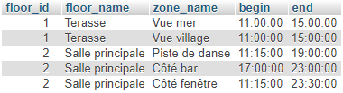

# JOURNAL DE BORD

## 06.04.20
- Création du Github
- Création du Trello 
- Appel avec m. Garcia pour mise en route du travail
- Création du document word pour la documentation

---
## 07.04.20
- Création du planning 
- Mise à jour du trello en fonction du planning
- UML : Je pense qu'il va manquer quelques tables, mais je n'arrive pas à savoir lesquelles. C'est pourquoi je vais commencer le projet avec les tables actuelles et j'ajouterais les tables au fur et a mesure.


- Mise en place et branchement du raspberry PI sur mon réseau local
- Mon rapsberry aura une adressen statique sur mon réseau privé afin de pouvoir tester l'âpplication depuis differents appareils

--- 
## 08.04.20
- Mise en place des liens entre les tables de la base de données. La base de données n'est pas encore complète. Il manque principalement la structure pour le stockage des position et forme pour l'UI style "drag & drop".
- Création de l'api
- /!\ L'API va me prendre plus de temps que ce que je pensais, je vais donc changer le Trello afin de créer des sous-tâches pour le dévellopement de l'API.

### API V1
Pour le moment mon API est encore très basique. Je n'ai que accès au employés et aux login. Afin de pouvoir accéder à la base de données, voici les logins :
- username : resa_tech_es
- password : WhutMerYmZeR6EHb

### Login avec l'API (MAJ le 23.04.2020)
Afin de stocker les mot de passe en hashé dans la base de données j'utilise un système de hashage.
1. l'utilisateur entre son mot de passe
2. Le mot de passe est ensuite hashé en sha256
3. la clé (u7csu5qH6Cp9xWkrIgtGvTsOosnKvH9RhQOXteJtNhknqrEHcjp8dCGYuv02SBoHGsBRoN0zGeGeToULmWUDTb2HAgnSGntNJHmg) est aussi hashée en sha256
4. On conquataine les deux chaines 
5. La chaîne finale est encore une fois hashée en sha256
6. Le programme copmpare la chaîne hashée avec la chaîne stockée dans la base

---
## 09.04.20
 - ~~Création de la section READ pour la table client dans l'API~~

### ~~API : READ Client~~
- ~~**GetAllCLients** : récupère tous les clients de la base de données~~
    1. ~~api/client/get/?all~~
- ~~**GetClientById** : récupère un client en fonction de son **id**~~
    1. ~~api/client/get/?id=[l'id que l'on cherche] (ex : get/?id=1)~~
- ~~**GetClientByLastname** : récupère tous les clients avec le nom de famille passé en paramètre~~
    1. ~~api/client/get/?lastname=[nom que l'on cherche] (ex : get/?lastname=Pala)~~
- ~~**GetClientByFirstname** : récupère tous les clients avec le prénom passé en paramètre~~
   1. ~~api/client/get/?firstname=[prénom que l'on cherche] (ex : get/?firstname=Ana)~~

Comme toute la structure de la base de données à changer, j'ai du changer l'API (en passant à la v2) et donc les fonctionnalités ci-dessus ne sont plus d'actualités.

---
## 14.04.20
- Mise à jour du Trello et réponses aux remarques de M. Garcia 
- Mise à jour du planning prévisionnel en incluant la mise en place de tests unitaires
- Modification de la base de données 
    - Ajout de la table "is_manager". Cette table permet à un gérant d'avoir plusieurs établissements
    - Ajout des tables de scores afin que les clients et les restaurateurs puissent ce mettre des notes anonymement
- Ajout de données dans la base de données afin de pouvoir faire les tests de l'API
- Les 'username' pour les employés sont générés automatiquement et sont unique à la base de données. Le login est composé d'uniquement 4 chiffres (je ne pense pas qu'un restaurant ai plus de 9999 employés...). Ce choix est fait pour permettre un login rapide en tapant uniquement les 4 chiffres du login et le mot de passe. A voir si je ne vais pas enlever le mot de passe lorsque l'on ce trouve sur le réseau du restaurant afin de pouvoir encore plus rapidement ce connecter lors du service.
- La table "is_manager" permet de stocker l'identifiant de l'employé qui est le manager. Ce manager peut avoir plusieurs restaurant et aussi être employé de ceux-ci ou d'autres (dont il n'est pas le manager).

### Comptes pour les test BDD

#### Employés
##### Administrateur
- username : 2008
- password : admin (b3ab939cbaa34ecf36b7e07bdcefce4d2c913517bd345daecab7f91c69fbe269)

##### Manager du Restaurant "Port Martignot"
- username : 3383
- password : manager (30963bb3ca13371a5b776434c2959c87b53113d7817a23a1f523c15863350ee7)

##### Employés du Restaurant
###### Olivier
- username : 5243
- password : e1 (3710f1a472febbc82026d64452ee8f1b38e801149b1c72310dc8e576b1d3b972)

###### Mathilde
- username : 9902
- password : e2 (4c4b520592f51d5456edd751d3f8d771a5c0895d65de5f8c9537804cffc32ad0)

#### Divers informations pour le restaurant
##### Floors (étages)
###### La térasse
- zone :
    1. Vue mer
    2. Vue village

- horaires : 
    1. Vue mer : 11:00 - 15:00
    2. Vue village : 11:00 - 15:00

###### La salle principale 
- zone :
    1. Piste de danse
    2. Coté bar
    3. Coté fenêtre

- horaires : 
    1. Piste de danse : 11:15 - 19:30
    2. Coté bar : 11:15 - 23:30
    3. Coté fenêtre : 11:15 - 23:30

---
## 15.04.20
- Discussion avec M. Garcia
    1. Ce focaliser sur la réservation interne 
    2. On est ouvert sur l'évolution de la visibilité exterieur 
    3. Fusionner les tables client et employé
    4. (Tâche future) Simuler de la charge 
- Modification de la base de données
    1. Ajout de la table images
    2. Ajout de la table de liasion entre menu et images + table de liaison entre etablissement et images
    3. Fusion de la table client et employé
- Après avoir mis à jour la base de données avec l'uml. Je dois refaire l'impo rtation dans mon serveur et mettre à jour les fichiers de l'API que j'avais déjà développer
- Je dois egallement réintroduire des données dans la base. Pour le moment je ne vais que créer des utilisateurs (les mêmes que cité ci-dessus), un restaurant, quelques zones, horaires et tables. Je m'occuperais de toute la partie réservation plus tard.

- Pour demain : mettre à jour la base de donnée du serveur

---
## 19.04.20
- La v2 de la base de données à été ajoutée au serveur
- Création des liens entre les tables

### Les niveaux de permissions
1. Administrateur
2. Manager
3. Serveur
4. Stagiaire (Je ne sais pas si ce niveau sera réellement utile, mais on ne sait jamais)
5. Client
6. Invité

### API V2
Afin de maintenir la base de données à jour avec l'api, j'ai décidé de reprendre l'api v1 et d'en faire une v2 afin de garantir le fonctionnement de la v1.

Voici le diagramme de la base de données dans la V2 de l'API :


#### Les changements par rapport à la v1
1. Il n'y a plus de dossier "user" et "employe", car les deux ont été funsionné (comme les tables) en user.
2. Dans le dossier user, on retrouve toujours le dossier get et set (qui ne sont pas terminés à ce stade) et un dossier employe. Ce dossier va me permettre de mieux gerer la partie uniquement employés. Je pense également mettre un dossier "clients" afin de mieux gerer les clients de la base de données.

#### La table "user"
La table user change donc. Il y a toujours le champ (permission qui risque de changer de table car un user peut etre manager d'un restaurant mais client d'un autre...)

/!\ Du coup je viens de me rendre compte que je dois changer ma base de données... Je ne vais pas créer un v3, je vais juste supprimer les tables non nécéssaires et ajoutés celles dont je vais avoir besoin. 

- Je supprime donc les tables "work_for" et "is_manager" ainsi que le champ "permission_id" de la table "user"
- je vais créer une table de liasion nommée "is_in_as" comme référence à : is in etablishement as ...". Cette table va prendre 3 champs
    1. L'id de l'user
    2. L'id du restaurant (etablissement)
    3. L'id de la permission
- L'id du restaurant reste NULL si c'est un administrateur qui as tous les droits sur tous les restaurants et sur l'application en entier 

#### Récuperer tous les employés qui sont dans la table "user"
Pour récuperer tous les user qui sont employés d'un ou de plusieurs restaurants, je dois passer par la table de laision "is_in_for".
Du coup j'ai créer une commande sql qui permet de retrouver tous les user en fonction de leur(s) permission(s).
- La commande : ```SELECT `user`.`first_name`, `user`.`last_name`, `user`.`phone`, `user`.`email`, `user`.`username` FROM `user` WHERE `user`.`id` IN (SELECT `is_in_as`.`idUser` FROM `is_in_as` WHERE `is_in_as`.`idPermission` = [id de la permission que l'on cherche])```

Cette commande je vais la mettre dans le dossier "get" du dossier "user" et sara accessible comme ceci : Travail_diplome_ES_2020/RESA/api/v2/user/get/?as=[id de la permission que l'on cherche]

Je pense aussi faire la version ou on peut chercher en mettant le nom. par exemple : "manager" au lieu de "2", mais je ne sais pas si c'est vraiment utile en sachant que c'est l'application qui va faire les appels à l'API et non l'utilisateur

---
## 20.04.20
- Afin de garantir la sécurité de mes requètes, j'ai quand même mis en places quelques mesures de sécurités. Par exemple, dans la requête ci-dessus, avant de l'éxécuter, je vérifie bien que le paramètre envoyé est bien un entier afin de ne pas laisser entrer des requêtes externes.
- Avancement de l'API V2
- Avancement de la documentation en suivant les demandes faites par m. Garcia.
- Creation d'un répertoire de sauvegarde dans EDUGE + ajout du lien dans la documentation et le journal de bord

- Pour trouver tous les employés d'un restaurant, qu'il soit stagiaire, serveur ou manager, je vais créer une fonction qui regroupe tous les employés uniquemement en tapant l'id du restaurant.
  - La requete SQL : ```SELECT `user`.`first_name`, `user`.`last_name`, `user`.`phone`, `user`.`email`, `user`.`username` FROM `user` WHERE `user`.`id` IN (SELECT `is_in_as`.`idUser` FROM `is_in_as` WHERE `is_in_as`.`idEtablishement` = [id de l'établissement])```

### /!\ Problème 1

#### Problématique
Je me retrouve face à un problème : la table "is_in_as" possède l'id du user, l'id de l'établissement et l'id de la permission.

Le but est que uniquement en mettant l'id de l'établissement, on puisse trouver les information de l'utilisateur avec ses permissions correspondantes pour l'établissement en question.


#### Solution possibles
1. J'ai d'abord regarder la solution de "UNION", mais ça ne correspond pas à ce que je cherche.
2. Faire un join et ensuite un select (pas sûr)

#### Solution
La solution à donc bien été de faire des inner join ( plus facile que ce que je pensais... !). La requête SQL ressemble donc à ceci : 

- ```SELECT u.first_name as user_firstname, u.last_name as user_lastname, p.name as permission_name, p.level as permission_level FROM is_in_as as iis INNER JOIN permission as p ON p.id = iis.idPermission INNER JOIN user as u ON u.id = iis.idUser WHERE iis.idEtablishement =  [id de l'établissement rechercher]```

A présent, pour trouver tous les employés travaillant dans un restaurant, il suffit de rechercher l'id du restaurant désiré. 

ex : /RESA/api/v2/user/employes/?workingFor=1 (1 = Port Martignot)

### Etablissement
Il est possible qu'une de mes tables porte a confusion. La table "menu". En réalité cette table devrais s'appeller "carte", car la carte regroupe les différents menus que propose le restaurant.

Il faudrais aussi que j'ajoute une table pour des plats à l'unité mais ce n'est pas l'option clé de cette application.

- Ajout de la fonction pour pouvoir rechercher tous les restaurants ou juste un d'après son id.

---
## 21.04.20
- Voici le schéma pour construire une zone dans un restaurant :


Afin de réaliser des tests, je vais utiliser les des zones (appartenant au restaurant port m.) et les horaires suivante :
1. Vue mer : 11:00 - 15:00
2. Vue village : 11:00 - 15:00
3. Piste de danse : 11:15 - 19:00
4. Côté bar : 17:00 - 23:00
5. Côté fenêtre : 11:15 - 23:30

"vue mer" et "vue village" ce trouvent sur "la terasse", alors que "piste de danse", "côté bar" et côté fenêtre" ce trouvent dans la salle principale.

1. Terasse
   1. Vue mer
   2. Vue village
2. Salle principale
   1. Piste de danse
   2. Côté bar
   3. Côté fenêtre

La table horaire contiens les données suivantes:
1. 11:00 - 15:00
2. 11:15 - 23:30
3. 11:15 - 19:00
4. 17:00 - 23:00

Afin de vérifier que les liasons soient correctes, je vais ajouter dans l'api une fonction qui permet de récupérer tous les étages avec toutes les informations les concernant d'un restaurant.

- Requête SQL pour récuperer tous les étages (floor) d'un restaurant : ```SELECT f.name FROM `floor` as f WHERE f.idEtablishment = 1```

- Requête SQL pour récupérer tous les étages avec leurs zones : ```SELECT f.id, f.name, z.name FROM `floor` as f JOIN `has_zone` as hz ON hz.idFloor = f.id JOIN `zone` as z ON z.id = hz.idZone WHERE f.idEtablishment = 1```

- Requête SQL pour récupérer toutes les infos sur les étages : ```SELECT f.id as floor_id, f.name as floor_name, z.name as zone_name, s.begin, s.end FROM `floor` as f JOIN `has_zone` as hz ON hz.idFloor = f.id JOIN `zone` as z ON z.id = hz.idZone JOIN `zone_has_schudle` as zhs ON zhs.idZone = z.id JOIN `schudle` as s ON s.id = zhs.idSchudle WHERE f.idEtablishment = 1```

Je dois maintenant faire le tri dans les données que je recois, car quand j'appelle la méthode, l'API me retorune pour le moment un tableau avec plusieurs fois le même étage (parcque cet étage a plusieurs zones). Hors, moi je veux 1 étages avec un tableau de ses zones.

Voici le résultat que j'obtiens avant le tri :


Afinde trier les données, j'ai créer une fonction qui va automatiquement créer un tableau d'étages qui contiendra le nom de l'étage et un tableau des zones :


---

## 22.04.20

- J'ai ajouté 2 salles dans un nouvel établissement afin de tester le fait que la suppression d'un étage supprime bien les zones qui lui étaient associées
- Avant de faire le point ci-dessus, je vais d'abord faire en sorte de pouvoire créer un établissement, des étages et des zones
- Je viens de penser au fait que je devrais ajouter une table qui permet de gérer les exceptions, par exemple un jour une zone dois fermer plus tôt
- Création du "CREATE" pour les établissements
- Je souhaites récupérer toutes les permissions pour un utilisateurs. Pour ce faire je procède en 3 étapes :
    1. Je récupère les infos de l'utilisateurs
        -   ```SELECT `id`, `first_name`, `last_name`, `phone`, `email`, `username` FROM `user` WHERE `id` = [id de l'utilisateur]```
    2. Je récupère toutes les permissions qui sont accordées à l'utilisateur
        - ```SELECT IFNULL(e.name, "-") etablishment_name, IFNULL(p.name, "-") as permission_name FROM user as u LEFT JOIN is_in_as as iia ON iia.idUser = u.id LEFT JOIN establishment as e ON e.id = iia.idEtablishement LEFT JOIN permission as p ON p.id = iia.idPermission WHERE u.id = [id de l'utilisateur]```

### Récupérer le menus d'un restaurant
Afin de pouvoir récupérer tous les plats et compositions dans le menu d'un restaruant je dois procédé étape par étape. 
1. Récupérer le menu du restaurant : 
    - ```SELECT m.id, m.name, m.description FROM `menu` as m WHERE m.id IN (SELECT e.id_menu FROM `establishment`as e WHERE e.id = [id du restaurant])``` 
2. Récupérer tous les plats qui ce trouvent dans ce menu
    - ```SELECT d.name as dish_name, d.price as dish_price, dt.name as type_name FROM `menu` as m INNER JOIN `menu_has_dishes` as mhd ON mhd.idMenu = m.id INNER JOIN `dish` as d ON d.id = mhd.idDish INNER JOIN `dish_type` as dt ON dt.id = d.idType WHERE m.id IN (SELECT e.id_menu FROM `establishment`as e WHERE e.id = [id du restaurant])```
3. La prmière requête me donne un tableau avec les données de l'utilisateur et la deuxième me rend un tableau de tableau avec les permissions pour chaque établissement. J'ajoute donc un index nommé "permissions" dans le tableau de l'utilisateur ce qui donne ceci : 


- Ajout de la table meal et de la table menu_has_meal
- La base de données gère comme ceci les menus des restaurants : 

- J'ai ajouter des données dans la base afin de pouvoir faire des tests.
(Pour anouveau avoir le même résultat qu'avec les étages, je vais devoir reprendre la fonction [ci-dessus](./Documentation/Images/Fonction_recherche_etages.PNG) et l'ajuster pour les menus)

Pour récupérer les menus composés, il faut éxécuter une autre requête SQL
- ```SELECT ml.id as meal_id, ml.name as meal_name, entrance.name as entrance_name, main.name as main_name, dessert.name as dessert_name, IFNULL(drink.name, "-") as drink_name, ml.price as price FROM `menu_has_meal` as mhm INNER JOIN `meal` as ml ON ml.id = mhm.idMeal INNER JOIN `dish` as entrance ON ml.entrance = entrance.id INNER JOIN `dish` as main ON ml.main = main.id INNER JOIN `dish` as dessert ON ml.dessert = dessert.id LEFT JOIN `dish` as drink ON ml.drink = drink.id INNER JOIN `menu` as menu ON menu.id = mhm.idMenu WHERE mhm.idMenu IN (SELECT e.id_menu FROM establishment as e WHERE e.id = 2)```
- Résultat de la requête SQL :


#### Unire les 2 résultats de recherche
Le but à présent est d'unire les 2 résultats. J'ai créer une fonction qui fait appel des deux fonctions ci-dessus et qui créer un tableau suivant :

- Menu
  - infos
    - id
    - name
    - description
  - dishes
    - Tableau des plats
  - Meals
    - Tableau des menus composés


### Appel avec M. Garcia
- Ajouter un état "non réservable" sur les fournitures
- Utiliser "distinct" ou "group by" pour la fonction de recherche de étages

### Test de "distinc" et de "group by"
#### Group by
- J'ai ajouté le paramètre suivant à ma requête SQL : ```GROUP BY f.id``` ou f.id = floor id. Mais SQL me donnais une erreur comme quoi je devais trier avec tous les champs.
- J'ai donc transformer le group by comme ceci : ```GROUP BY f.id, z.name, s.begin, s.end```. Le résultat était éxactement le même que sans rien...

#### Distinc
Le paramètre "distinc" permet de retourner uniquement des valeurs différentes. Le problème est que tous mes champs sont déjà différents, car chaque zone n'est attribuée que à un étage.

#### Conclusion
Les deux outils sont puissants et vont certainement êtres utiles dans un futur proche, mais pour cette fonction, ils ne sont malheureusement pas adaptés à ce que je veux faire.

---

#### Le développement de l'API va me prendre beaucoup plus de temps que prévu... je vais devoir faire des choix sur les fonctionnalités à ajouter... A suivre

---

---

## 23.04.20
### L'objectif du jour est de continuer un maximum l'API. Et de commencer 2 - 3 vues qui récupèrent les restaurants et leurs menus.
La complexité de mon travail de diplôme est la gestion de réservation en fonction des horaires des zones. Pour le moment je ne me suis pas encore penché sur le problème, car l'API de base, me prend du temps. Je vais revoir mon planning.

- Geré le Login d'un utilisateur
  - J'utilise la même méthode que dans la V1 de l'API


- Création d'un cheat sheet pour l'API afin de rendre son utilisation plus facile par un externe
  - Le but de ce cheat sheet est de faciliter l'utilisation de l'API aux personnes qui aurons besoin de l'utiliser afin de continuer l'application ou pour une autre utilisation.
  - Ca me permet également de retrouver ou et comment récupérer un certain type de données que je cherche.

- Au début je pensais commencer des vues, mais le cheat sheet me prend pas mal de temps, je commencerais donc les premières vues demain.
### APPEL M. Garcia
- Regarder pour convention / norme requête SQL

#### Bonnes pratiques SQL
Afin d'unifier mon code avec les bonnes pratiques, je me suis référé au [site](https://wiki.easyvista.com/xwiki/bin/view/Documentation/SQL+rules?language=fr) que m. Garcia m'as fait parvenir.

---
## 24.04.20

### CES DIAGRAMMES d'ACTIVITES NE SONT PLUS A JOUR ! VOIR PLUS BAS ...
- Création du  diagramme d'activité pour la création d'un compte client dans l'application :


- Création du  diagramme d'activité pour faire une réservation dans un restaurant :


- Objectif actuellement :
  - Faire les vues et le script qui tourne derrière afin de déjà faire fonctionner les diagrammes ci-dessus
  - Mettre à jour la documentation avec les demandes de m. Garcia : **OK** 
  - Mettre en place le système des images afin d'avoir de belles vues : **OK [terminé le 24.04 à 23:53]**

- Afin de pouvoir mettre les images dans la base de données avec un uniqID, je dois créer une page provisoire pour uploader les photos sur le serveur
  - Je vais donc créer une page php avec une form simple qui me permet de selectionner un des plats de la base et la photo à mettre en ligne
  - La page est accessible via : ```/api/v2/images/upload/debug/```
  - J'ai vite du ajouter une fonction dans l'API, une fonction qui me permet de récupérer tous les plats de la base
  - J'ai donc créer un formulaire qui permet de sélectionner le restaurant ou le repas auquel on souhaites ajouter une photo. 
  - Il faut maintenant que je fasse la partie de l'API qui permet d'ajouter le lien entre la photo et le plat ou l'etablissement
  - J'ai créer la partie de l'api qui me permet de mettre en ligne un photo avec un uniqid. (Ca m'as pris un temps fou)
  - L'upload est totalement temriné ! ```/api/v2/images/upload/```
    - Pour utiliser ce fichier, il faut l'include dans celui qui va envoyer l'image (Plus d'explication dans le Cheat sheet de l'API v2)
  - Il est possible de récupérer les informations d'une image d'après son id et le paramètre "data". ```/api/v2/images/get/?path&id=[id de l'image]```
  - Il est possible d'être directement rediriger sur la photo en indiquant uniquement son id : ```/api/v2/images/get/?id=[id de l'image]```
  - Il est possible de récupérer toutes les images d'un établissement !
  - Je suis en train d'ajouter la requête pour récupérer toutes les photos d'un plat mais je me dis que je devrais aussi faire en sorte que l'on puisse récupérer toutes les images d'un menu entier d'un restaurant. A retenir

### Evalutation intermédiaire (appel avec m. Garcia)
#### Documentation 
- Ajouter le numéro de version sur la page de garde : **OK**
- Titre de la table des matières : **OK**
- Mettre des numéros devant les titres : **OK**
- Ajouter le mot "page" devant le numéro de page + "/" et le numéro de pages totaux du document : **OK**
- Créer un diagramme d'activités (par qui ça passe) -> J'en ai fait 2, ce sont les deux avec lesquels je vais commencer les vues

#### Github
- Penser à supprimer les mot de passes

#### Google Drive
- (Ajout la syncronisation avec google Drive)
- Faire des backups QUOTIDIEN et non tous les 2 jours
- Règle de nommage : ```année_mois_jour(_heure_minute_secondes)_[nom fichier].extension```

#### Serveur 
- J'aurais du utiliser WSL au lieu de laragon

#### Login
- Au lieu d'utiliser des cartes RFID 

#### Images
- Utiliser la fonction unique ID de PHP pour renommer les images mises en ligne
- https://www.php.net/manual/fr/function.uniqid.php

#### Poster
- Expert ont de la peine a ce retrouver -> faire un diagramme physique

---
## 26.04.20
- Suite de la documentation, commencement de la partie de la gestion des images.
- J'ai commencer la structure de l'API dans la documentation, mais je ne vais pas la terminer car celle.ci risque de changer.

### Page Login
- Création de la page de login à partir du template
  - Nettoyage de la page et des composants non-nécéssaires

### Idées pour plus tard afin de encore plus me faciliter la vie
- Ajout d'un nouveau fichier dans le dossier ```images``` de l'API. Ce fichier va permettre de directement envoyer le résultat d'un ```forms``` directement à ce fichier afin qu'il puisse ajouter la photo dans la base de données.

--- 
## 27.04.20

### Appel avec m. Garcia
- Voir si Laraval et iyy peut être plus efficace

- J'ai effectuer des recherches pour voir si Laravel ou iyy allaient pouvoir me faciliter la tâche pour mon travail. Malheureusement rien ne correspond à ce dont j'ai réellement besoin, car mes requêtes sont tellement spécifiques que un générateur de code ne me sert à rien.

---
## 28.04.20

- Création du [fichier](./Documentation/Gestion_taches_API.xlsx) 
 des tâches à faire pour l'API 
- Je vais reprendre mes diagrammes d'activités
  - Il faut que je comprenne d'abord, comment réaliser correctement un diagramme d'activité.
  - Je vais utiliser le lien ci-dessus comme model pour les normes que j'utilise.
- J'ai un peu continuer la documentation

- Création du diagramme d'activité pour la connexion et création de compte :  

Après avoir pris 2 jours de recul sur mon projet, j'ai pu me rendre compte de ce que j'avais réellement à faire. Je vais donc faire un nouveau tableau des tâches à faire (dans l'ordre) et des priorités. Comme c'est un projet qui demande beaucoup de temps et de tables, je dois faire la part des choses.

- Croquis des choses à faire dans un premier temps :  

- Mise au propre des choses à faire :  

M. Garcia valide ma nouvelle approche.

### Appel avec m. Garcia 
- Utilisation de DrawIO 
  - Permet de sauver directement dans le Google Drive
  - Produit directement les UML
- Trouver des normes pour lés diagrammes d'activités : https://sourcemaking.com/uml/modeling-business-systems/external-view/activity-diagrams
- Inconsistances dans les diagrammes
  - S'inspirer des normes
  - Revoir mes diagrammes

---
## 29.04.20
- Je suis en train de faire le login d'un utilisateur, je me suis rendu compte que je devais faire la différencation de si il s'agissait d'un login client ou d'un login utilisateur local.
  - Il faut que j'ajoute à l'API une fonctionnalité qui gère la différence
    - Je vais donc créer cette fonctionnalité
    - Afin de pouvoir ajouter cette fonctionnalité, j'ai un petit souci... Un utilisteur admin peut ce connecter dans tous les restaurants, il faut donc que ma requête gère si il s'agit de d'un admin
    - ### Il ne faut pas que j'oublie de mettre à jour le cheat sheet !
  - Il faut que j'ajoute une fonction de login avec l'email 
  - (je ne sais pas si je dois aussi hasher le username et l'email ou non ... Pour le moment je ne vais pas le faire car les emails sont public...)
- Ajout du fond d'écran de tous les profils utilisateurs
  - Accessible à partir de l'API
- Il faut que je fasse un table de liaison entre les utilisateurs et une photo de profil
  - La table de liaison est terminée
  - Ajout d'une image test grace au debug
- Il faut mettre à jour l'API pour récupérer l'image l'utilisateur
  - C'est fait ! Pour accéder à la photo, il faut récupérer le chemin de l'image sur ce lien : ```http://localhost/Travail_diplome_ES_2020/RESA/api/v2/images/get/?user&id=[id de l'utilisateur]```

Malheureusement aujourd'hui je n'ai pas fait tout ce que je voulais... Je n'ai fait que le login avec l'affichage de l'utilisateur connecté. Demain j'affiche tous les réstaurants !

### Requête de login employé
Vérifie uniquement si l'utilisateur travail bien pour l'établissement : ```SELECT u.id as idUser, u.first_name as firstnameUser, u.last_name as lastnameUser, u.phone as phoneUser, u.email as emailUser, p.name as namePermission, p.level as levelPermission, IFNULL(e.id, "-") as idEtablishment, IFNULL(e.name, "-") as nameEtablishment FROM `is_in_as` as iia INNER JOIN `permission` as p ON p.id = iia.idPermission LEFT JOIN `establishment` as e ON e.id = iia.idEtablishement INNER JOIN `user` as u ON u.id = iia.idUser WHERE iia.idUser IN (SELECT `id` FROM `user` WHERE `username` = '[numéro d'identification]' AND `password` = '[mot de passe hashé]') AND iia.idEtablishement = [id de l'établissement]```

Retourne le nom de l'utilisateur si l'identifiant d'utilisateur et le mot de passe éxistent bien dans l'établissement ou est membre de l'administration :
```SELECT u.id as idUser, u.first_name as firstnameUser, u.last_name as lastnameUser, u.phone as phoneUser, u.email as emailUser, p.name as namePermission, p.level as levelPermission, IFNULL(e.id, "-") as idEtablishment, IFNULL(e.name, "-") as nameEtablishment FROM `is_in_as` as iia INNER JOIN `permission` as p ON p.id = iia.idPermission LEFT JOIN `establishment` as e ON e.id = iia.idEtablishement INNER JOIN `user` as u ON u.id = iia.idUser WHERE iia.idUser IN (SELECT `id` FROM `user` WHERE `username` = '[numéro d'identification]' AND `password` = '[mot de passe hashé]') AND (iia.idEtablishement = [id de l'établissement] OR iia.idPermission = 1)```

La requête ci-dessus ne me sert pas dans l'imédiat, mais au moins elle est prête !

### Création de la page de profil
- Reprise du template pour créer la page de profil de l'utilisateur 
- Il faut maintenant que je récupère les données de la session afin de vérifier que l'utilisateur soit bien connécté et qu'il puisse bien avoir ces informations

### Appel avec m. Garcia
- Chercher un outil qui intègre des données dans la base 
  - Il va contacter un ancien élève qui avait utilisé ça. En attendant de ses nouvelles, je vais continuer mon programme.

- Liens potentiels pour le remplissage automatique de données :
  - http://www.generatedata.com/?lang=fr#t1
  - https://github.com/benkeen/generatedata

---
## 30.04.20
- Finitions de la page des établissements
- Ajout d'établissements dans la base afin de tester la mise en page
  - J'ai fait exprès de ne pas mettre de photo pour un réstaurant afin que celui-ci affiche l'image par défaut
- Je vais faire la page qui affiche le réstaurant afin de pouvoir commencer à faire la logique des réstaurants
- J'ai créer dans la page de l'utilisateur un panel qui contient 3 tabs
  - Le premier permettra de voir les dernieres ou futures réservations
  - Le deuxieme permettre de changer la photo de profil (C'est peut-être la que je vais utiliser le Dropzone.js [REF : ci-dessous])
  - Le dernier permet de créer facilement un établissement
    - J'ai du mettre en place le formulaire avec les tests pour vérifier que les champs étaient bien valides
    - J'ai du ajouter une partie à l'API 

### Création d'un nouvel établissement 
Voici comment je créer la query que j'envoie ensuite pour la création d'un nouvel établissement
```
$queryData = array(
    'name' => $data['name'],
    'address' => $data['adress'],
    'phone' => $data['phone'],
    'email' => $data['email'],
    'creatorID' => $creatorID
);

$link1 = $path."etablishment/create/?".http_build_query($queryData);

file_get_contents($link1);
```

- J'ai du faire beaucoup de changements du côté de l'API dans les images
  - ```SaveImageDish``` ainsi que ````SaveImageUser``` ne fonctionnent plus actuellement, mais ce ne sont pas des priorités pour le moment

La deuxième étape, est de faire un upload des images sur le serveur... un peu plus compliqué.
- ~~Je viens de voir un problème que j'avais dans ma logique d'enregistrer mes images... malheureusement je les enregistrait dans mon API, hors je dois les enregistrer sur le site web et uniquement envoyer le lien à l'API~~

### MAJ API
- Ajout de la fonctionnalité "is in as" qui permet de directement mettre le créateur de l'établissement en temps que manager 
- Cette fonction peut être utilisée pour tout type d'ajout (pas seulement manager)
- Afin que je puisse directement assigné le créateur en temps que manager, je dois récupérer le dernier ID introduis dans la base de données.
- Il faut que je finisse la méthode ```is in as``` car je l'ai oubliée ...
  - C'est fait ! J'ai perdu énormément de temps car j'avais inversé 2 champs (tristesse)
- Il faut que j'ajoute aussi un fonction qui me permet de récupérer tous les restaurants d'un manager
  - D'abord je récupère tous les établissements ou travaille le manager (à garder, elle pourra me servir plus tard)
    - SQL : ```SELECT e.id, e.name FROM `is_in_as` as iia INNER JOIN `establishment` as e ON e.id = iia.idEtablishement WHERE iia.idUser = [id du manager]```
  - J'ajoute juste le ```AND``` à la fin avec l'id des manager (2)
    - SQL : ```SELECT e.id, e.name FROM `is_in_as` as iia INNER JOIN `establishment` as e ON e.id = iia.idEtablishement WHERE iia.idUser = [id du manager] AND iia.idPermission = 2```

~~### Dropzone.js~~
- ~~Afin de pouvoir autoriser le ```drag & drop``` de photos dans mes formulaires, j'ai utilisé un librairie standalone. Cette librairie s'appelle [dropzone.js]("https://www.dropzonejs.com/")~~
- Malheureusement ça ne fonctionnais pas comme je le pensais et ça n'est pas compatible avec mon utilisation... Je ne vais pas m'attarder plus sur ça aujourd'hui.
Si jamais j'ai à nouveau besoin, voici les 2 includes :
  - ```<link rel="stylesheet" href="https://cdnjs.cloudflare.com/ajax/libs/dropzone/5.5.1/dropzone.css" />```
  - ```<script src="https://cdnjs.cloudflare.com/ajax/libs/dropzone/5.5.1/dropzone.js"></script>```

### Appel avec m. Garcia
- Les utilisateur doivent êtres archivés
  - Afin de garder l'historique
- Trouver un outil qui fait toute l'arboration de l'API
  - La commande ```tree``` dans le cmd

### Programme pour demain (avant que j'oublie)
- Afficher la liste de tous les établissements appartenant à un utilisateur
- Afficher la liste de tous les établissements ou travaille l'utilisateur 
- Mettre à jour le Cheat Sheet pour l'API 
- Mettre à jour les commentaires de l'API
- Continuer A FOND la documentation